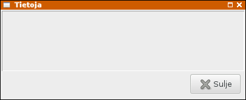

# Tietoja-dialogi

Asetamme päävalikon valinnan `gtk-about` ("Tietoja...") kutsumaan funktiota `showResultPics`. Se avaa dialogi-ikkunan, joka esittää tulosten kuvaajat.

```
menuBarDescr = 
  [("_Tiedosto", 
    [("gtk-open", openFile),
     ("gtk-select-font", openFont),
     ("gtk-preferences", setPreferences),
     ("gtk-about", showResultPics),
     ("gtk-quit", quitProgram)])
  ]
```

Toteutamme kuvaajien piirron myöhemmin. Kuvaajia varten varaamme tilan vieritysikkunalle `scrolledWin`.

```
showResultPics gsRef = do
  gs <- readIORef gsRef
  dialog <- dialogNew
  set dialog [ windowTitle := "Tietoja" ]
  upbox <- dialogGetUpper dialog

  vbox1 <- vBoxNew False 0
  scrolledWin <- scrolledWindowNew Nothing Nothing
  scrolledWindowSetPolicy scrolledWin PolicyAutomatic PolicyAutomatic
  widgetSetSizeRequest scrolledWin 400 100
  boxPackStart upbox scrolledWin PackGrow 0
  scrolledWindowAddWithViewport scrolledWin vbox1

  dialogAddButton dialog stockClose ResponseClose

  widgetShowAll upbox
  response <- dialogRun dialog
  widgetDestroy dialog
  return ()
```

Tyhjä dialogi-ikkuna näyttää tältä:



Ohjelmakoodi: [aboutDialog.hs](aboutDialog.hs)

