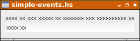
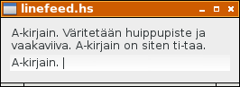
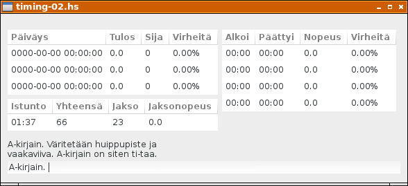
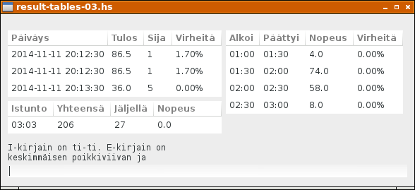
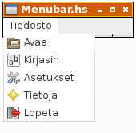
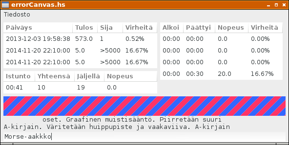
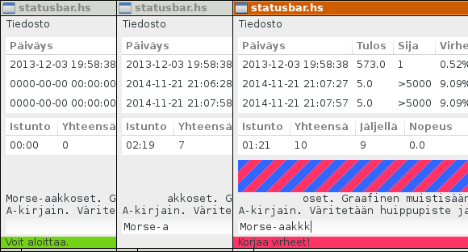
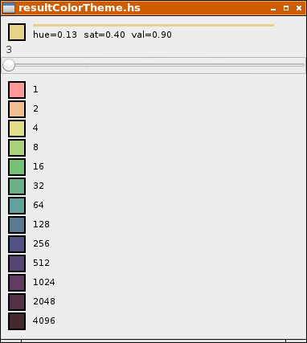

# Hatupist

Hatupist on kirjoitusnopeuden harjoitusohjelma. Rakennamme ohjelman alkaen tyhjästä ikkunasta. Käytämme Haskell-ohjelmointikieltä ja Gtk2hs-käyttöliittymäkirjastoa.

# Tyhjä ikkuna

Seuraava ohjelma avaa yksinkertaisen tyhjän ikkunan:

```
import Graphics.UI.Gtk

main = do
  initGUI
  window <- windowNew
  onDestroy window mainQuit
  widgetShowAll window
  mainGUI
```

Funktio `onDestroy` on tapahtumankäsittelijä, joka määrittää ikkunan käyttäytymisen suljettaessa ikkuna esimerkiksi hiirellä ruksia naksautettaessa. Toimenpide yhdistetään funktioon `mainQuit`, joka on ohjelman lopetuskomento.

Tallenna ohjelma nimellä `plain-ui.hs` ja anna pääteikkunaan komento `runhaskell plain-ui.hs`. Ohjelma käynnistyy tulkattavassa muodossa ja tuottaa seuraavan ikkunan ruudulle: 


# Yksinkertainen käyttöliittymä

Katsotaan seuraavaksi tiedostoa [plain-ui-002.hs](plain-ui-002.hs)

Ajettaessa komennolla `runhaskell plain-ui-002.hs` ohjelma tuottaa seuraavan ikkunan:


Ohjelma sisältää kaksi tyypin `Label` komponenttia ja tekstikentän tyyppiä `Entry`. Ne luodaan funktioilla `labelNew` ja `entryNew`. Komponentit sijoitetaan vertikaaliseen laatikkoon `vbox` joka luodaan funktiolla `vBoxNew`. Näiden lisäksi käytetään erottimia `sep1` ja `sep2` tyhjän tilan saamiseksi komponenttien väliin. Erottimet luodaan funktiolla `hSeparatorNew`. Kukin komponentti paketoidaan vertikaaliseen laatikkoon `vbox` funktiolla  `boxPackStart`.

Esimerkkinä tyypin `Label` komponentti:

```
  label1 <- labelNew (Just xxx)
  miscSetAlignment label1 0 0
  boxPackStart vbox label1 PackNatural 0
```
# Tekstikentän asettelua

Kuvassa näkyvän tekstikentän sinisen reunuksen saamme pois komennolla

```
  entrySetHasFrame entry False
```

Lisäksi haluamme tekstirivit täsmällisesti allekkain. Siirrämme tekstiä kahdella pikselillä oikealle:

```
  miscSetPadding   label1 2 0
  miscSetPadding   label2 2 0
```

Emme tarvitse myöskään erottimia tekstikenttien väliin, joten poistamme ne.


Ohjelmakoodi tähän mennessä: [plain-ui-003.hs](plain-ui-003.hs)

# Tekstitiedoston lukeminen

Tekstitiedoston manipulointiin voisi käyttää vaikkapa seuraavanlaista koodia:

```
lineLen = 35

main = do
  originalText <- readFile ("morse.txt")
  print originalText
  let liness = colLines (collectWords (words (originalText)) lineLen)
  let lines = map (++" ") liness
  mapM_ putStrLn (lines)

colLines (xs:xss) =
  (unwords xs) : colLines xss
colLines [] = []

collectWords [] n = []
collectWords ys n =
  p1 : collectWords p2 n
  where
  (p1,p2) = splitAt (length (untilLen ys 0 n)) ys

untilLen (t:ts) s n 
  | s+x<n || s==0  = t : untilLen ts (s+x) n
  | otherwise      = []
  where
  x = length t + 1
untilLen [] s n = []
```

Kirjoitetaan tekstitiedostoon `morse.txt` kokeilumielessä seuraava teksti:

```
Morse-aakkoset.

Graafinen muistisääntö.

Piirretään suuri A-kirjain. Väritetään kirjaimen huippupiste ja 
vaakaviiva. A-kirjain on siten ti-taa.

Seuraavaksi piirretään I-kirjain. Väritetään kirjaimen molemmat päät. 
I-kirjain on ti-ti.

E-kirjain on keskimmäisen poikkiviivan leikkauspiste pystyviivan kanssa. 
E-kirjain on ti.

O-kirjaimessa on pitkästi ympyrän kehää väritettäväksi. Täytetään kehä 
kolmella viivalla. O-kirjain on taa-taa-taa.

U-kirjaimesta väritetään molemmat huippupisteet ja pohjakaari. U-kirjain 
on ti-ti-taa.
```

Edellinen ohjelmakoodi tulostaa nyt:

```
$ runhaskell readFile.hs 
"Morse-aakkoset.\n\nGraafinen muistis\228\228nt\246.\n\nPiirret\228\228n su
uri A-kirjain. V\228ritet\228\228n kirjaimen huippupiste ja vaakaviiva. A-k
irjain on siten ti-taa.\n\nSeuraavaksi piirret\228\228n I-kirjain. V\228rit
et\228\228n kirjaimen molemmat p\228\228t. I-kirjain on ti-ti.\n\nE-kirjain
 on keskimm\228isen poikkiviivan leikkauspiste pystyviivan kanssa. E-kirjai
n on ti.\n\nO-kirjaimessa on pitk\228sti ympyr\228n keh\228\228 v\228ritett
\228v\228ksi. T\228ytet\228\228n keh\228 kolmella viivalla. O-kirjain on ta
a-taa-taa.\n\nU-kirjaimesta v\228ritet\228\228n molemmat huippupisteet ja p
ohjakaari. U-kirjain on ti-ti-taa.\n\n"
Morse-aakkoset. Graafinen 
muistisääntö. Piirretään suuri 
A-kirjain. Väritetään kirjaimen 
huippupiste ja vaakaviiva. 
A-kirjain on siten ti-taa. 
Seuraavaksi piirretään I-kirjain. 
Väritetään kirjaimen molemmat 
päät. I-kirjain on ti-ti. 
E-kirjain on keskimmäisen 
poikkiviivan leikkauspiste 
pystyviivan kanssa. E-kirjain on 
ti. O-kirjaimessa on pitkästi 
ympyrän kehää väritettäväksi. 
Täytetään kehä kolmella viivalla. 
O-kirjain on taa-taa-taa. 
U-kirjaimesta väritetään molemmat 
huippupisteet ja pohjakaari. 
U-kirjain on ti-ti-taa. 
```

Tekstin manipulointiin tarvittavat rutiinit riippuvat hieman tekstitiedoston muodosta, ja periaatteessa tämän vaiheen voisi jopa sivuuttaa muokkaamalla tekstitiedosto valmiiksi tekstieditorilla. Haskell-kielen Prelude-kirjastosta käytettäviä funktioita olivat `words` ja `unwords`, joiden toimintaperiaate seuraavassa:

```
$ ghci
Prelude> let ws = words "U-kirjaimesta väritetään molemmat huippupisteet ja pohjakaari"
Prelude> ws
["U-kirjaimesta","v\228ritet\228\228n","molemmat","huippupisteet","ja","pohjakaari"]
Prelude> unwords ws
"U-kirjaimesta v\228ritet\228\228n molemmat huippupisteet ja pohjakaari"
Prelude> :q
Leaving GHCi.
```

Ohjelmakoodi: [readFile.hs](readFile.hs)

# Tapahtumankäsittelyä

Tarkastellaan lähdekoodia: [simple-events.hs](simple-events.hs)

Ohjelma luo tutun ikkunan.



## Tekstikentän tekstin muutos

Funktiolla `onEditableChanged` tekstikenttä `entry` saa tapahtumankäsittelijän `entryTextChanged`. 

```
  entry  <- entryNew
  entrySetHasFrame entry False
  boxPackStart vbox entry PackNatural 3
  onEditableChanged entry ( 
    entryTextChanged entry)
```

Tapahtumankäsittelijän toiminta on yksinkertainen, se tulostaa tapahtuman nimen, sen POSIX-ajan ja tekstikentän tekstin ruudulle.

```
entryTextChanged entry = do 
  txt <- entryGetText entry
  pt  <- getPOSIXTime
  putStrLn ("Entry ## " ++ (show pt) ++ ": " ++ txt)
  return ()
```
## Ajastintapahtuma

Ajastin alustetaan funktiolla `timeoutAdd`. Ensimmäinen parametri on tapahtumankäsittelifunktio `timeIsOut`. Toinen parametri on aika millisekunteina.

```
  timeoutAdd timeIsOut 1000
```

Myös tämä tapahtumankäsittelijä on toiminnaltaan yksinkertainen, tulostaen tapahtuman nimen ja POSIX-ajan.

```
timeIsOut = do
  pt <- getPOSIXTime
  putStrLn ("Timer ## " ++ show pt)
  return True
```

Tyypillinen käyttökerta tulostaa

```
$ runhaskell simple-events.hs 
Timer ## 1413918113.807756s
Entry ## 1413918114.648762s: x
Timer ## 1413918114.808328s
Entry ## 1413918115.200725s: xx
Entry ## 1413918115.662261s: xxx
Timer ## 1413918115.80882s
Entry ## 1413918116.278175s: xxxx
Timer ## 1413918116.810192s
Entry ## 1413918117.120765s: xxxx 
Entry ## 1413918117.478783s: xxxx x
Entry ## 1413918117.682427s: xxxx xx
Timer ## 1413918117.81128s
Timer ## 1413918118.812609s
Timer ## 1413918119.813201s
$ 
```

# Tulostaulut

Ohjelman ajatus on, että kirjoitusnopeuden mittaus jaetaan puolen minuutin intervalleihin (jatkossa `i`-etuliite nimissä). Varsinainen tulos on neljän peräkkäisen intervallin merkkimäärien summa, eli kahden minuutin jakso. Tuloksia ylläpitävä tietorakenne on nimeltään `Result` (`r`-etuliite nimissä). Istunnolla (Session, `s`-etuliite) puolestaan tarkoitetaan ajanjaksoa ensimmäisen merkin syöttämisestä ikkunan sulkemiseen, tietorakenne `Timing`.

```
iDuration = 30
rDuration = 120
amountOfIntervals = rDuration `div` iDuration

data Result = Result { 
  rDate :: String, 
  rMrks, rRank, rErrs :: Int
} deriving (Read, Show)

zeroResult = Result {
  rDate = "0000-00-00 00:00:00", 
  rMrks = 0, rRank = 0, rErrs = 0 }

data Timing = Timing {
  sSession :: String, sTotal :: Int, 
  sSecsLeft :: Int,   sSpeed :: Double
} deriving Show

zeroTiming = Timing {
  sSession = "00:00", sTotal = 0,
  sSecsLeft = iDuration, sSpeed = 0.0 }

data Interval = Interval {
  iNum, iMrks, iErrs :: Int 
} deriving Show

zeroInterval = Interval {
  iNum = -1, iMrks = 0, iErrs = 0 }
```

Näitä kolmea tietorakennetta kohden on oma tulostaulunsa ohjelman ikkunassa. Tulostauluun luotava alustava malli, sarakkeiden otsikot ja tätä vastaava funktio solun sisällön tulostamiseksi on määritelty seuraavassa:

```
rInitModel = replicate 3 zeroResult
rColTitles = ["Päiväys", "Tulos",         "Sija",        "Virheitä" ]
rColFuncs  = [ rDate,     rSpeed . rMrks,  show . rRank,  rErrorPros]

sInitModel = [zeroTiming]
sColTitles = ["Istunto", "Yhteensä",     "Jakso",          "Jaksonopeus"]
sColFuncs  = [ sSession,  show . sTotal,  show . sSecsLeft, f01 . sSpeed]

iInitModel = replicate amountOfIntervals zeroInterval
iColTitles = ["Alkoi",        "Päättyi",    "Nopeus",       "Virheitä" ]
iColFuncs  = [ iStarts . iNum, iEnds . iNum, iSpeed . iMrks, iErrorPros]
```

Käyttöliittymä luodaan tuttuun tapaan funktiossa `createGUI`:

```
createGUI = do
  window <- windowNew
  onDestroy window mainQuit

  outerVBox  <- vBoxNew False 0
  middleHBox <- hBoxNew False 0
  innerVBox1 <- vBoxNew False 0
  innerVBox2 <- vBoxNew False 0

  rModel <- setupView rInitModel rColTitles rColFuncs innerVBox1
  sModel <- setupView sInitModel sColTitles sColFuncs innerVBox1
  iModel <- setupView iInitModel iColTitles iColFuncs innerVBox2

  boxPackStart middleHBox innerVBox1 PackNatural 0
  boxPackStart middleHBox innerVBox2 PackNatural 6
  boxPackStart outerVBox middleHBox PackNatural 10

  set window [
    containerBorderWidth := 10,
    windowTitle := "Hatupist",
    containerChild := outerVBox ]

  label1 <- labelNew (Just xxx)
  miscSetAlignment label1 0 0
  boxPackStart outerVBox label1 PackNatural 0

  label2 <- labelNew (Just xxx)
  miscSetAlignment label2 0 0
  boxPackStart outerVBox label2 PackNatural 0

  textview <- textViewNew
  boxPackStart outerVBox textview PackNatural 3
  buffer <- textViewGetBuffer textview

  widgetShowAll window
  
  return GUI {
    gBuffer = buffer,
    gLabel1 = label1,
    gLabel2 = label2
  }
```

Tulostaulujen näkymä luodaan funktiolla `setupView`, joka tässä vaiheessa näyttää seuraavalta:

```
setupView initModel titles funcs parent = do
  model <- listStoreNew (initModel)
  view  <- treeViewNewWithModel model
  mapM 
    ( \(title, func) -> newcol view model title func )
    ( zip titles funcs )
  set view [ widgetCanFocus := False ]
  boxPackStart parent view PackNatural 3
  return model
  where
    newcol view model title func = do
      renderer <- cellRendererTextNew
      col <- treeViewColumnNew
      cellLayoutPackStart col renderer True
      cellLayoutSetAttributes col renderer model (
        \row -> [ cellText := func row])
      treeViewColumnSetTitle col title
      treeViewAppendColumn view col
```

Solutekstien muotoilemiseen on erinäinen määrä apufunktioita, joiden toimintalogiikkaan ei tässä vaiheessa kannattane kiinnittää suurempaa huomiota:

```
rErrorPros rR = 
  f02p (errorPros (rErrs rR) (rMrks rR))

iErrorPros iV = 
  f02p (errorPros (iErrs iV) (iMrks iV))

errorPros errs mrks 
  | errs == 0 && mrks == 0 = 0.0
  | errs /= 0 && mrks == 0 = 100.0
  | otherwise = 100.0 * (intToDouble errs) / (intToDouble mrks)

f01 :: Double -> String
f01 = printf "%.1f"

f02p :: Double -> String
f02p = printf "%.2f%%"

iSpeed mrks = 
  f01 ((intToDouble mrks)* 60.0 / intToDouble iDuration)

rSpeed mrks = 
  f01 ((intToDouble mrks)* 60.0 / intToDouble rDuration)

iStarts n
  | n <= 0    = "00:00"
  | otherwise = mmss (fromIntegral (n*iDuration) :: Double)

iEnds n = iStarts (n+1)

mmss seconds =
  leadingZero (show (floor seconds `div` 60)) ++ 
  ":" ++ 
  leadingZero (show (floor seconds `mod` 60))

leadingZero s
  | length s < 2 = "0" ++ s
  | otherwise    = s

intToDouble :: Int -> Double
intToDouble i = fromRational (toRational i)
```

Ohjelman tuottama ikkuna näyttää nyt tältä:


# Ohjelman tila

Ohjelma on kulloinkin yhdessä seuraavista tilosta:

```
data GameStatus = Error | Correct | Back | NotStarted
  deriving (Eq, Show)
```

`NotStarted`: Ohjelman käynnistyessä, kun yhtään merkkiä ei ole syötetty. Tilarivillä näytetään teksti "Voit aloittaa". Tulostaulut näyttävät nollaa, eikä ajastinta ole käynnistetty.

`Correct`: Käyttäjä on kirjoittanut tekstiä, ja teksti on oikein. Näppäimistönpainallukset rekisteröidään.

`Error`: Käyttäjä on lyönyt virhelyönnin. Virhe rekisteröidään ja käyttäjää pyydetään korjaamaan virheet. Ohjelma on tässä tilassa siihen saakka kunnes teksti on jälleen oikein, jolloin siirrytään takaisin tilaan `Correct`. 

`Back`: Teksti on oikein, mutta käyttäjä (jostain syystä) poistaa merkkejä. Näppäimistönpainalluksista ei tällöin synny rekisteröitävää tietoa.

Tila määräytyy tapahtumankäsittelijässä `whenEntryChanged`. Samalla vanha tila otetaan talteen. Vanha tila `oldStatus` saa arvon nykyiseltä tilalta `status`.

```
whenEntryChanged gsRef = do
  pt  <- getPOSIXTime
  gs  <- readIORef gsRef
  txt <- entryGetText (gEntry (g gs))
  let label1Str = head (oLabelStrs gs)
      status = getStatus txt label1Str (oldlen gs)
      f = case (status,oldStatus gs) of
        (_,NotStarted)  -> whenNotStarted status
        (Correct,_)     -> whenCorrect txt
        (Error,Correct) -> whenNewError
        otherwise       -> whenOther status (oldStatus gs)
      cprfix = length (commonPrefix txt label1Str)
  newGs <- f pt gsRef gs
  set (gLabel1 (g gs)) [ 
    labelLabel := blankStart cprfix label1Str]
  writeIORef gsRef newGs {
    oldStatus = status,
    oldlen = max cprfix (oldlen gs),
    nextLetter = nextChar cprfix label1Str
  }
  drawStatusText gsRef
  widgetQueueDraw (gErrorCanvas  (g gs))
  widgetQueueDraw (gHelperCanvas (g gs))
  when (label1Str == txt) (advanceLine gsRef newGs)
  return ()

whenNotStarted status gui settings lines gsRef gs = do
  putStrLn ("Started with " ++ (show status))
  return ()

whenCorrect gui settings lines gsRef gs = do
  print "Correct."
  return ()

whenNewError gui settings lines gsRef gs = do
  print "New Error."
  return ()

whenOther status oldStatus gui settings lines gsRef gs = do
  putStrLn ("Other with " ++ (show (status,oldStatus)))
  return ()
```

Tyypillinen tuloste kokeiltaessa edellistä näyttää tältä:

```
(Correct,NotStarted,"M")
Started with Correct
(Correct,Correct,"Mo")
"Correct."
(Error,Correct,"Mou")
"New Error."
(Back,Error,"Mo")
Other with (Back,Error)
(Correct,Back,"Mor")
"Correct."
(Back,Correct,"Mo")
Other with (Back,Correct)
```

# Rivinvaihto

Jotta komponenttien välittäminen funktion parametreina onnistuisi helpommin, keräämme välitettävät komponentit yhteen tietorakenteeseen.

```
data GUI = GUI {
  gEntry :: Entry,
  gLabel1, gLabel2 :: Label
}
```
Asetukset ovat tietorakenteessa `Settings`, niitä ei tässä vaiheessa ole montaa.

```
data Settings = Settings {
  lineLen :: Int, startLine :: Int,
  textfile :: String
} deriving (Read, Show)
```
Asetukset saavat oletusarvonsa funktiossa `defaultSettings`.

```
defaultSettings = Settings {
  lineLen = 40, startLine = 0,
  textfile = "morse.txt"
}
```

Näkyvissä olevat tekstirivit saadaan yksinkertaisella funktiolla `labelStrings`, joka palauttaa kahden rivin taulukon.

```
labelStrings :: Int -> [String] -> [String]
labelStrings startline lines =
  [lines !! first] ++ [lines !! second]
  where
    first = startline `mod` (length lines)
    second = (startline + 1) `mod` (length lines)
```
Kun tekstikentän sisältö muuttuu, tarkistetaan se tapahtumankäsittelijässä `whenEntryChanged` ja sen saavuttaessa saman arvon kuin kirjoitettavana oleva tekstirivi, vaihdetaan se uuteen funktiolla `advanceLine`.

```
whenEntryChanged gui lines gsRef = do
  gs  <- readIORef gsRef
  txt <- entryGetText (gEntry gui)
  let label1Str = head (oLabelStrs gs)
  when (label1Str == txt) (advanceLine gui lines gsRef gs)
  return ()
```

Funktio advanceLine lisää tilamuuttujassa olevan nykyisen rivinumeron `currentLine` arvoa yhdellä. Kun tiedostossa ei ole enää uusia rivejä kirjoitettavaksi, aloitetaan uudelleen alusta. Tämä tapahtuu pitämällä rivinumero annetuissa rajoissa jakojäännösfunktion `mod` avulla.

```
advanceLine gui lines gsRef gs = do
  writeIORef gsRef gs {
    currentLine = ncline
  }
  renewLabels gui ncline lines gsRef
  return ()
  where
    ncline = ((currentLine gs) + 1) `mod` (length lines)
```
Ohjelman tulostama ikkuna:



Lähdekoodi [linefeed.hs](linefeed.hs)

# Ajanottoa

Intervallit eli kolmenkymmenen sekunnin jaksot on siis määritelty tietorakenteessa `Interval`, ja alustamaton oletusintervalli on nimeltään `zeroInterval`, sen tuntee numerosta -1. Lyöntimäärät ja virheet lasketaan kenttiin `iMrks` ja `iErrs`.

```
data Interval = Interval {
  iNum, iMrks, iErrs :: Int 
} deriving Show

zeroInterval = Interval {
  iNum = -1, iMrks = 0, iErrs = 0 }
```

Tietorakenteeseen `State` lisätään aloitusaikaa kuvaava kenttä `startTime`, joka alustetaan epämääräiseen nolla-aikaan vuoteen 1970.

```
data State = State {
  status :: GameStatus,
  startTime :: POSIXTime,
  ...

initState = State {
  startTime = fromIntegral 0 :: POSIXTime,
  oldStatus = NotStarted,
  ...
```

Kun lyönnin aika `t` sekunteina tunnetaan, saadaan intervallin numero, johon lyönti kuuluu, yksinkertaisella funktiolla:

```
intervalNumber t =
  floor t `div` iDuration
```

`POSIXtime`-tyyppi (ja jatkossa lyhenne `pt`) on kellonaika alkaen vuodesta 1970 sekunteina, joten se käy sekuntimäärien vertailemiseen yksinkertaisella tyyppimuunnoksella:

```
secondsFrom startPt endPt =
  a - b
  where
    a = ptToDouble endPt
    b = ptToDouble startPt

ptToDouble :: POSIXTime -> Double
ptToDouble t  = fromRational (toRational t)
intToDouble :: Int -> Double
intToDouble i = fromRational (toRational i)
```

Tässä funktiot `fromRational` ja `toRational` ovat esimerkkejä tyyppiluokkien mukaan kuormitetuista funktioista, eli ne tekevät muunnoksen annettujen tyyppimäärittelyjen mukaisesti.

Puskurin muutoksiin vastaava koodi on nyt seuraavassa muodossa:

```
whenEntryChanged gui settings lines gsRef = do
  pt  <- getPOSIXTime
  gs  <- readIORef gsRef
  txt <- entryGetText (gEntry gui)
  let label1Str = head (oLabelStrs gs)
      status = getStatus txt label1Str (oldlen gs)
      f = case (status,oldStatus gs) of
        (_,NotStarted)  -> whenNotStarted status
        (Correct,_)     -> whenCorrect
        (Error,Correct) -> whenNewError
        otherwise       -> whenOther status (oldStatus gs)
  newgs <- f gui settings pt gs
  writeIORef gsRef newgs {
    oldStatus = status,
    oldlen = max (length (commonPrefix txt label1Str)) (oldlen gs)
  }
  when (label1Str == txt) (advanceLine gui lines gsRef gs)
  return ()

whenNotStarted status gui settings pt gs = do
  putStrLn ("Started with " ++ (show status))
  return gs { 
    startTime = pt 
  }

whenCorrect gui settings pt gs = do
  print "Correct."
  let s = secondsFrom (startTime gs) pt
      i = intervalNumber s
  print (s,i)
  return gs

whenNewError gui settings pt gs = do
  print "New Error."
  return gs

whenOther status oldStatus gui settings pt gs = do
  putStrLn ("Other with " ++ (show (status,oldStatus)))
  return gs
```

Nyt naksuteltaessa noin yhden merkin viidessä sekunnissa, saatiin seuraava tuloste, josta näkyy kulunut sekuntimäärä ja intervalli, johon näppäimistönpainallus kuuluu:

```
$ runhaskell timing.hs 
Started with Correct
"Correct."
(3.952288866043091,0)
"Correct."
(9.909076929092407,0)
"Correct."
(15.482538938522339,0)
"Correct."
(20.866790771484375,0)
"Correct."
(26.18815588951111,0)
"Correct."
(31.308336973190308,1)
"Correct."
(36.21953082084656,1)
```

Ohjelmakoodi [timing.hs](timing.hs)

Ensi kerralla käytämme tätä hyväksi, ja keräämme nämä tiedot niitä vastaaviin tietorakenteisiin.

# Ajanotosta tulostauluihin

Jotta tulostaulujen sisältöä päästään muuttamaan, tarvitaan siis viitteet näiden taulujen malleihin:

```
data GUI = GUI {
  gEntry :: Entry,
  gLabel1, gLabel2 :: Label,
  gModelR :: ListStore Result,
  gModelS :: ListStore Timing,
  gModelI :: ListStore Interval
}
```

Nämä viitteet luotiin funktiossa `createGUI`:

```
  rModel <- setupView rInitModel rColTitles rColFuncs innerVBox1
  sModel <- setupView sInitModel sColTitles sColFuncs innerVBox1
  iModel <- setupView iInitModel iColTitles iColFuncs innerVBox2
  ...
  return GUI {
    gEntry = entry,
    gLabel1 = label1, gLabel2 = label2,
    gModelR = rModel, gModelS = sModel, gModelI = iModel
  }
```

S-taulun ainoa rivi (rivinumero 0) päivitetään nyt funktiolla `listStoreSetValue`. Sen parametrit ovat viite malliin (`gModelS gui`), rivinumero ja tietorakenne `Timing`, joka sisältää näytettävien kenttien saamat arvot.

```
renewTableS gui gs t = do
  listStoreSetValue (gModelS gui) 0 Timing {
    sSecsLeft = iLeft t,
    sSession = mmss t,
    sTotal = total gs,
    sSpeed = 0.0
  }
```

Ensimmäisen näppäimistönpainalluksen seurauksena kutsuttavaan funktioon `whenNotStarted` on lisätty komento `timeoutAdd`, joka käynnistää ajastimen.

```
whenNotStarted status gui settings lines pt gsRef gs = do
  putStrLn ("Started with " ++ (show status))
  timeoutAdd (onTimeout gui gsRef) 500
```

Ajastimen toiminta määritellään seuraavassa:

```
onTimeout gui gsRef = do
  gs <- readIORef gsRef
  pt <- getPOSIXTime
  let t = secondsFrom (startTime gs) pt
      iCur = iNumber t
  renewTables gui gs t iCur
  writeIORef gsRef gs {
    lastShownIv = iCur
  }
  return True
```

Pienet apufunktiot `iNumber` ja `iLeft` kertovat jakson numeron ja paljonko jaksossa on sekunteja jäljellä.

```
iNumber t =
  floor t `div` iDuration

iLeft t =
  iDuration - (floor t `mod` iDuration)
```

Tilastoitavat näppäimistönpainallukset kerätään oikeisiin intervalleihin funktiossa `addTime`: 

```
addTime status i intervals =
  [newHead] ++ tail newIvs
  where
  newHead = case status of
    Correct -> headIv { iMrks = (iMrks headIv) + 1 }
    Error   -> headIv { iErrs = (iErrs headIv) + 1 }
  headIv = head newIvs
  newIvs = if i /= latestIvNum intervals
    then [zeroInterval { iNum = i }] ++ intervals
    else intervals
```

Käytännössä nämä muodostavat kasvavan taulukon, jossa kenttä `iNum` kertoo jakson numeron, ja kentät `iMrks` ja `iErrs` lyöntimäärät ja virheet seuraavaan tapaan:

```
[Interval {iNum = 1, iMrks = 9, iErrs = 0},Interval {iNum = 0, iMrks = 68, iErrs = 2}]
```


Jatkamme tulostietojen käsittelemistä ensi kerralla. Ohjelmakoodi tähän mennessä [timing-02.hs](timing-02.hs)

# Tulostaulut R, S ja I


Tulostauluja on siis kolme, näistä istunnon S-taulu päivitetään puolen sekunnin välein. Kaksi muuta taulua päivitetään, kun siirrytään intervallista toiseen. Monadin sisällä tämä ehtolause ei ole kovin selkeästi luettava, mutta se on seuraavassa:

```
renewTables gui gs t iCur = do
  renewTableS gui gs t 
  newGs <- if (lastShownIv gs /= iCur)
  then renewSeldomTables gui gs iCur
  else return gs
  return newGs
```

Intervallien I-taulun päivityksen yhteydessä lasketaan kahden minuutin tulos ja siivotaan pois tarpeettomat intervallit:

```
renewTableI gui gs iCur = do
  mapM 
    (\(a,b) -> listStoreSetValue (gModelI gui) (amountOfIntervals-a) b) 
    (zip [1..] showIvs)
  return gs {
    intervals = newIvs,
    lastShownIv = iCur,
    results = [zeroResult {
       rMrks = sum [iMrks g | g <- showIvs]
    }]
  }
  where
    iMaxShow = iCur - 1
    infimum = iMaxShow - amountOfIntervals + 1
    iMinShow = max 0 infimum
    iMinNeed = max 0 (infimum + 1)
    newIvs = ivsFrom iMinNeed (intervals gs)
    showIvs = reverse (ivsAllBetween iMinShow iMaxShow (intervals gs))
```

Näytettävien intervallien alaraja on muuttuja `iMinShow` ja yläraja `iMaxShow`. Seuraavaan kertaan näistä ei tarvitse säilyttää alarajan intervallia, joten tarvittavien intervallien alaraja `iMinNeed` on yhden korkeampi. Uudet intervallit ovat nyt siis taulukossa `newIvs` ja näytettävät intervallit taulukossa `showIvs`. Kahden minuutin tulos saadaan laskemalla merkkimäärät näytettävistä intervalleista kaavalla

```
rMrks = sum [iMrks g | g <- showIvs]
```

Tässä vaiheessa heitämme tuon laskun tuloksen yksinkertaisesti tulosten R-taulun alimmalle riville:

```
latestResult results = if null results 
  then zeroResult
  else head results

renewTableR gui gs iCur = do
  listStoreSetValue (gModelR gui) 2 (latestResult (results gs))
  return ()
```

Pienet apufunktiot, joita käytämme intervallien suodattamiseen, ovat esitettynä seuraavassa. Intervalleihin ei taltioidu nollatuloksia, mutta I-taulussa ne halutaan näyttää, ja tästä syystä määrittelemme funktiot `ivsAllBetween` ja `ivExactly`.

```
ivsBetween iMin iMax ivs =
  filter (\iv -> iMin <= (iNum iv) && (iNum iv) <= iMax) ivs

ivsFrom iMin ivs =
  filter (\iv -> iMin <= (iNum iv)) ivs

ivsAllBetween iMin iMax ivs =
  [ivExactly n ivs | n <- [iMin .. iMax]]

ivExactly n ivs =
  case find (\iv -> n == (iNum iv)) ivs of
    Just x  -> x
    Nothing -> zeroInterval { iNum = n }
```

Kirjoitusnopeus kauniissa muodossa merkkijonona esitettynä saatiin jakamalla merkkimäärä aikavälin pituudella (mrk/min, jossa 1min=60.0s).

```
rSpeed mrks = 
  f01 ((intToDouble mrks)* 60.0 / intToDouble rDuration)
```

Funktiota `addTime` on myös hieman muutettu. Se sisältää nyt tarkistuksen tyhjän taulukon varalta.

```
addTime status i intervals =
  [newHead] ++ tail newIvs
  where
  newHead = case status of
    Correct -> headIv { iMrks = (iMrks headIv) + 1 }
    Error   -> headIv { iErrs = (iErrs headIv) + 1 }
  headIv = head newIvs
  newIvs = if null intervals || i /= latestIvNum intervals
    then [zeroInterval { iNum = i }] ++ intervals
    else intervals
```

Ohjelmakoodi: [result-tables-02.hs](result-tables-02.hs)

# Tulosten vertailua

Laskimme edellisellä kerralla intervallit, joilla on merkitystä tuloksen määräytymisessä. Nyt käytämme näiden intervallien taulukkoa parametrina, ja laskemme kyseisen tuloksen:

```
addResult showIvs gs = do
  pt <- getPOSIXTime
  tz <- getCurrentTimeZone
  let newResult0 = zeroResult {
    rDate  = timeFormatted (utcToZonedTime tz (posixSecondsToUTCTime pt)),
    rMrks = sum [iMrks g | g <- showIvs],
    rErrs = sum [iErrs g | g <- showIvs]
  }
  let newResult = newResult0 {
    rRank = tellRank newResult0 (results gs)
  }
  let 
    newRs = take maxRank (insert newResult (results gs))
    newShownRs = [
      bestResult newRs,
      (sessionBest gs) `min` newResult,
      newResult ]
  return (newRs, newShownRs)

timeFormatted :: ZonedTime -> String
timeFormatted = formatTime defaultTimeLocale "%Y-%m-%d %H:%M:%S"

tellRank x xs =
  case findIndex (x <=) xs of
    Just n  -> n + 1
    Nothing -> length xs + 1
```

Muuttuja `newResult0` on päivämäärän, merkkimäärän ja virhemäärän sisältävä nimetty tietue. Sitä tarvitaan välituloksena, jotta voimme selvittää mille sijalle tuloksissa saavutettu kirjoitusnopeus sijoittuu. Muuttuja `newResult` on vastaava tietue, johon on lisätty kyseinen sijoitus, `rRank`. Sijoitus saadaan funktiosta `tellRank`. Tulostauluun määrittelemme tilaa viidelletuhannelle tulostietueelle. Uusi tulos lisätään oikeaan kohtaan taulukkoon `newRs`, ja tämän jälkeen taulukko typistetään tulostaulun maksimipituuteen.

Tulosten vertaileminen toisiinsa perustuu tyyppiluokkien `Eq` ja `Ord` hyväksikäyttöön. Kirjastosta `List` löytyy koko joukko funktioita, jotka osaavat käyttää tätä ominaisuutta hyväksi, esimerkiksi funktio `insert`.  Luomme tietorakenteelle `Result` instanssin näihin tyyppiluokkiin. Tuloksia kohdellaan samana, mikäli niiden merkkimäärä ja päivämäärä ovat samat. Samaan merkkimäärään päädyttäessä aikaisemmin saavutettua tulosta pidetään parempana verrattuna myöhemmin saavutettuun. Virhemäärä on mukana ainoastaan informaation vuoksi.

```
data Result = Result { 
  rDate :: String, 
  rMrks, rRank, rErrs :: Int
} deriving (Read, Show)

instance Eq Result where
  (Result date1 mrks1 rnk1 errs1) == (Result date2 mrks2 rnk2 errs2) =
    mrks1 == mrks2 && date1 == date2

instance Ord Result where
  compare = fasterFst

fasterFst (Result date1 mrks1 rnk1 errs1) (Result date2 mrks2 rnk2 errs2) =
  if mrks1 /= mrks2 
    then mrks2 `compare` mrks1
    else date1 `compare` date2 
```

Funktio `addResult` palauttaa päivitetyn tulostaulun lisäksi toisena tietueen alkiona taulukon `newShownRs`, johon on laskettuna kolme erityistä tulosta näytettäväksi ruudulla:

```
    newShownRs = [
      bestResult newRs,
      (sessionBest gs) `min` newResult,
      newResult ]

bestResult results = if null results 
  then zeroResult
  else head results
```

Ensimmäinen näistä on kaikkien aikojen paras tulos, toinen istunnon paras tulos ja kolmas viimeisin tulos. Näistä kaikkien aikojen paras tulos on sama kuin istunnon paras tulos, sillä emme toistaiseksi lainkaan tallenna tuloksia. Myös tässä funktio `min` käyttää hyväksi järjestysominaisuutta, joka on seurausta tyyppiluokkiin `Eq` ja `Ord` kuulumisesta.

Jätimme aikaisemmin toteuttamatta S-taulun sarakkeen "Jaksonopeus" laskemisen. Tulin ajatelleeksi, että ehkä sittenkin laskemme tuohon sarakkeeseen hetkellisen nopeuden kymmenen viimeisen sekunnin osalta. Muutamme S-taulun päivitysalgoritmia saadaksemme tarvittavat tiedot talteen:

```
renewTableS gui gs t = do
  pt <- getPOSIXTime
  let newGs = gs {
    speedNows = [(pt, (total gs))] ++ take speedCount (speedNows gs)
  }
  let s = difs (speedNows newGs)
  listStoreSetValue (gModelS gui) 0 Timing {
    sSecsLeft = iLeft t,
    sSession = mmss t,
    sTotal = total gs,
    sSpeed = speed (snd s) (fst s)
  }
  putStrLn (show (snd s) ++ " merkkiä " ++ f01 (fst s) ++ " sekunnissa")
  return newGs
```

Tässä `speedNows gs` on taulukko, johon keräämme kellonajan ja kellonaikaa vastaavan kokonaismerkkimäärän `total gs`. Kun nyt laskemme näiden kunkin erotuksen taulukon alusta ja lopusta, saamme hetkellisen kirjoitusnopeuden:

```
difs speds = 
  if null speds
    then (0.0, 0)
    else (secondsFrom (fst start) (fst end), (snd end) - (snd start))
  where
    start  = last speds
    end    = head speds

speed mrks t = 
  (intToDouble mrks) * 60.0 / (max t 1.0)
```

Olemme tässä jälleen käyttäneet epämääräisiä keinoja huolehtimaan, ettei synny nollalla jakoa tai pään etsimistä tyhjästä listasta.

Ohjelman ikkuna näyttää tässä vaiheessa seuraavalta:



Ohjelmakoodi tähän mennessä: [result-tables-03.hs](result-tables-03.hs)


# Kirjasin

Kirjasin muutetaan funktiossa `setFonts`, missä vaadittava parametri `fontstring` saa arvon "monospace". Tekstin kokoa voi muuttaa lisäämällä merkkikoon, esimerkiksi "monospace 12". Tasalevyistä kirjoituskonekirjasinta tarvitaan, jotta voimme tyhjentää merkkijonon välilyönneillä kun käyttäjä kirjoittaa sitä. Toinen vaihtoehto olisi piirtää merkkijonot itse, jolloin käyttäisimme funktiota `textExtents` selvittämään tyhjennettävän osuuden dimensiot. Tämä mahdollistaisi myös muiden kirjasimien käytön.

```
setFonts gui fontstring = do
  srcfont <- fontDescriptionFromString fontstring
  widgetModifyFont (gLabel1 gui) (Just srcfont)
  widgetModifyFont (gLabel2 gui) (Just srcfont)
  widgetModifyFont (gEntry gui)  (Just srcfont)
```

Olkoon nyt `n` kirjoitettujen merkkien lukumäärä. Näytettävä merkkijono on tällöin `n` kappaletta välilyöntejä lisättynä merkkijonon häntään, joka jää jäljelle pudottamalla `n` merkkiä pois alusta:

```
blankStart n str =
  replicate n ' ' ++ drop n str
```

Käytämme hyväksemme funktiota `commonPrefix`, ja teemme tarvittavat muutokset puskurin muutokseen vastaavaan tapahtumankäsittelijään `whenBufferChanged`:

```
commonPrefix (x:xs) (y:ys)
  | x == y       = x : commonPrefix xs ys
  | otherwise    = []
commonPrefix _ _ = []

cprfix = length (commonPrefix txt label1Str)

  set (gLabel1 gui) [ 
    labelLabel := blankStart cprfix label1Str]
```

# Tulosten tallentaminen

Ohjelman peruslogiikka alkaa olla valmiina, kunhan vielä tallennamme tulokset. Olemme aikaisemmin määritelleet tulostietotyypin periytymään tyyppiluokista `Show` ja `Read`, joten tietorakenteen lukeminen ja kirjoittaminen on automaattista. Periaattessa tulokset luetaan yksinkertaisten funktioiden `readFile` ja `read` avulla.

Vanhoja tuloksia lukiessamme saatamme todennäköisesti törmätä kahteen ongelmaan: tulostiedostoa ei ole olemassa tai tulostiedot eivät ole jäsenneltävässä muodossa. Kirjastosta `Control.Exception` löytyy funktio `catch`, joka todennäköisesti on yksinkertaisin mahdollinen virheenhallintaan soveltuva funktio. Se saa ensimmäisenä parametrinaan suoritettavan funktion, pyrkii suorittamaan sen, ja poikkeuksen eli virheen sattuessa suorittaa toisena parametrina annetun funktion.

Tiedoston sisältö luetaan ensin muuttujaan `content`. Tiedoston luvun epäonnistuessa oletetaan, että luettiin tyhjä merkkijono `""`. Virheen laadusta emme tässä tapauksessa ole kiinnostuneita.

```
  content <- readFile fname `catch` 
    \(SomeException e) -> return ""
```

Tiedoston sisältö jäsennetään nyt funktiolla `readRs`, jonka toteutus on standardi jäsennysfunktio `readIO`. Funktio `readIO` on kuormitettu funktio, joka tarvitsee tyyppimäärittelyn avulla tiedon siitä, minkätyyppiseen muotoon sen on yritettävä jäsentää merkkijono. Tässä tuo muoto on tyyppiä `Result` olevien alkioiden lista `[Result]`.

```
readRs :: String -> IO [Result]
readRs = readIO

```

Mikäli merkkijonon `content` jäsentäminen ei funktiolla `pFunc` onnistu, palautetaan operaation nolla-alkio, joka tässä tapauksessa on tyhjä lista `[]`.

```
  result <- pFunc content `catch` 
    \(SomeException e) -> return zero

```

Edellä käsitelty on koottuna seuraavassa:


```
resultsFromFile  fname = do
  structFromFile fname readRs []

structFromFile fname pFunc zero = do
  content <- readFile fname `catch` 
    \(SomeException e) -> return ""
  result <- pFunc content `catch` 
    \(SomeException e) -> return zero
  return result

readRs :: String -> IO [Result]
readRs = readIO

resultsFile  = "results.txt"
```

Kaikenkaikkiaan alustustietojen luomiseen ja lukemiseen käytettävä funktio `getStartupConfig` näyttää tässä vaiheessa seuraavalta. Oletuksena on, että ohjelman käyttämät tiedostot tallennetaan vastedes piilohakemistoon "/home/user/.hatupist/", joka luodaan, jollei sitä ole:

```
getStartupConfig gui gsRef = do
  gs <- readIORef gsRef
  -- directory
  homedir <- getHomeDirectory
  let dir = homedir ++ "/.hatupist"
  createDirectoryIfMissing False (dir)
  -- savedResults
  let rname = dir ++ "/" ++ resultsFile
  oldResults <- resultsFromFile rname
  putStrLn ("Reading " ++ rname ++ ": " ++ show (length (oldResults)) ++ " rows")
  listStoreSetValue (gModelR gui) 0 (bestResult oldResults)
  -- other
  setFonts gui "monospace"
  writeIORef gsRef gs {
    homeDirectory = dir,
    results = oldResults
  }

resultsFile = "results.txt"
```

Vastaavasti tulokset tallennetaan ohjelman päättyessä funktioiden `writeFile` ja `show` avulla:

```
quitProgram gsRef = do
  print "Quitting."
  gs <- readIORef gsRef
  let rname = (homeDirectory gs) ++ "/" ++ resultsFile
  writeFile rname (show (results gs))
  putStrLn ("Saving " ++ rname)
  mainQuit
```

Ohjelmakoodi tähän mennessä: [savedResults-01.hs](savedResults-01.hs)


# Parametrit tietorakenteena

Kun siirrämme graafisen käyttöliittymän, asetukset ja tekstirivit tietorakenteeseen `State`, vähenevät välitettävät parametrit funktiokutsuissa ja ohjelmasta tulee luettavampi.

Esimerkiksi funktio

```
whenEntryChanged gui settings lines gsRef 
```

voidaan esittää muodossa

```
whenEntryChanged gsRef 
```

Tietorakenne State sisältää nyt muun muassa seuraavat kentät:

```
data State = State {
  textLines :: [String],
  speedNows :: [(POSIXTime, Int)],
  intervals :: [Interval],
  results :: [Result],
  settings :: Settings,
  gui :: GUI
}
```

Tämän lisäksi määrittelemme lyhennysmerkinnät

```
s gs = settings gs
g gs = gui gs
r gs = results gs
```

Voimme nyt kutsua tietorakenteen `State` sisältämiä kenttiä seuraavaan tapaan:

```
textfile (s gs)
lineLen (s gs)
gModelR (g gs)
gEntry (g gs)
...
```

Piilotamme määrittelyn `Settings` kirjastosta `Graphics.UI.GTK`, koska haluamme käyttää sitä muihin tarkoituksiin.

```
import Graphics.UI.Gtk hiding (Settings)
```

# Päävalikko

Luomme ohjelmaan myös valikon, josta voi valita kirjoitettavan tiedoston, kirjasimen, asettaa muita asetuksia, nähdä tulosten kehitys ja lopettaa ohjelman. Tietoja-valikko eli tulosten kehitys jätetään toistaiseksi toteuttamatta, eli se on `noop`. Päävalikon valintamahdollisuudet on kerätty standardivalikkoteksteinä, joten ne suomentuvat ja saavat oikean kuvakkeen automaattisesti.



```
menuBarDescr = 
  [("_Tiedosto", 
    [("gtk-open", openFile),
     ("gtk-select-font", openFont),
     ("gtk-preferences", setPreferences),
     ("gtk-about", noop),
     ("gtk-quit", quitProgram)])
  ]

createMenuBar descr gsRef = do 
  bar <- menuBarNew
  mapM_ (createMenu bar) descr
  return bar
  where
    createMenu bar (name,items) = do 
      menu <- menuNew
      item <- menuItemNewWithLabelOrMnemonic name
      menuItemSetSubmenu item menu
      menuShellAppend bar item
      mapM_ (createMenuItem menu) items
    createMenuItem menu (stock,action) = do 
      item <- imageMenuItemNewFromStock stock
      menuShellAppend menu item
      onActivateLeaf item (do action gsRef)
    menuItemNewWithLabelOrMnemonic name
      | elem '_' name = menuItemNewWithMnemonic name
      | otherwise     = menuItemNewWithLabel name

noop gsRef = do
  return ()
```

# Kirjasindialogi

Kirjasin vaihdetaan valitsemalla päävalikosta kirjasindialogi. Kirjasindialogi on yksinkertainen ikkuna, jossa käyttäjältä kysytään uuden kirjasimen tiedot.

```
openFont gsRef = do
  gs <- readIORef gsRef
  result <- chooseFont "Valitse kirjasin" (font (s gs))
  case result of
    Just newFont -> do
      writeIORef gsRef gs {
        settings = (s gs) {
          font = newFont }}
      setFonts gsRef
    otherwise -> return ()

chooseFont prompt oldFont = do
  dialog <- fontSelectionDialogNew prompt
  fontSelectionDialogSetFontName dialog oldFont
  widgetShow dialog
  response <- dialogRun dialog
  print response
  case response of
    ResponseOk -> do
      fn <- fontSelectionDialogGetFontName dialog
      widgetDestroy dialog
      return fn
    ResponseCancel -> do
      widgetDestroy dialog
      return Nothing
    ResponseDeleteEvent -> do
      widgetDestroy dialog
      return Nothing
    _ -> return Nothing

```

Aikaisemmin huomiotta jäänyt asia on, että vanhojen tulosten sijoitukset luonnollisesti muuttuvat kun uusia syntyy. Tulokset on siis järjestettävä uudelleen:

```
reRank1 (Result { rDate = a, rMrks = b, rRank = c, rErrs = d }, newRank) =
  Result { rDate = a, rMrks = b, rRank = newRank, rErrs = d }

reRank rs = map reRank1 (zip rs [1..])
```
Ohjelmakoodi kokonaisuudessaan: [settings.hs](settings.hs)

# Virhekanvaasi

Lisätään piirtoalue `gErrorCanvas` tyyppiä `DrawingArea` virheestä ilmoittavaa piirrosta varten graafisen käyttöliittymän tietotyyppiin kentäksi.

```
data GUI = NotCreated | GUI {
  gErrorCanvas :: DrawingArea,
  gEntry :: Entry,
  gLabel1, gLabel2 :: Label,
  gModelR :: ListStore Result,
  gModelS :: ListStore Timing,
  gModelI :: ListStore Interval
}
```

Luodaan tätä vastaava komponentti graafisen käyttöliittymän luonnin yhteydessä. Kun piirtoalue vaatii uudelleenpiirron, se kutsuu tapahtumankäsittelijää `onExpose`. Yhdistetään tapahtumankäsittelijä funktioon `drawErrorCanvas`.

```
  errorCanvas <- drawingAreaNew
  widgetSetSizeRequest errorCanvas 300 40
  onExpose errorCanvas (
    drawErrorCanvas gsRef errorCanvas)
  boxPackStart outerVBox errorCanvas PackGrow 0
```

Funktio `drawErrorCanvas` määritellään seuraavassa. Kun ohjelman tila kertoo tapahtuneesta virheestä, kutsutaan funktiota `renderWithDrawable`. Muutoin näytetään ainoastaan tyhjä tausta, joka tapahtuu yksinkertaisesti palauttamalla totuusarvo `True`. Se kertoo käyttöliittymälle, että komponentti on piirretty eikä vaadi muita toimenpiteitä.

```
drawEmptyPicture canvas = do 
  return True

drawErrorCanvas gsRef widget _evt = do
  gs <- readIORef gsRef
  drawWin <- widgetGetDrawWindow widget
  (wInt,hInt) <- widgetGetSize widget
  let (w,h) = (intToDouble wInt, intToDouble hInt)
  if (oldStatus gs) /= Error
    then drawEmptyPicture widget
    else renderWithDrawable drawWin (drawErrorPicture w h)
  return True
```

Kun tekstikentän sisältö muuttuu, on myös virhekanvaasin tila tarkistettava ja pyydettävä järjestelmältä sen uudelleenpiirtoa funktiolla `widgetQueueDraw`.

```
whenEntryChanged gsRef = do
  ...
  widgetQueueDraw (gErrorCanvas  (g gs))
  when (label1Str == txt) (advanceLine gsRef newGs)
  return ()
```

Varsinainen piirtäminen tapahtuu piirtokirjaston Cairo avulla. Piirtokomennot ovat tuttuja Cairon piirtokomentoja `moveTo`, `relLineTo`, `closePath`, `setSourceRGB` ja `fill`. Näiden avulla piirretään sinipunainen raidoitus.


```
blue   = (0.200, 0.400, 1.000)
red    = (1.000, 0.200, 0.400)

relPolygon (x,y) points (r,g,b) = do
  moveTo x y
  mapM (\(x,y) -> relLineTo x y) points
  closePath
  setSourceRGB r g b
  fill

drawErrorPicture w h = do
  let c = h
      r = 15
  mapM 
    ( \(x,y,points,color) -> relPolygon (x,y) points color)
    [(x,0,[((-c),h),(r,0),(c,(-h))],
     color) | (x,color) <- zip [0,r..w+c] (cycle [blue,red])]
  return True
```

Sinipunainen raidoitus ikkunassa näyttää tältä:



Ohjelmakoodi: [errorCanvas.hs](errorCanvas.hs)

# Tilarivi

Lisätään graafisen käyttöliittymän tietotyyppiin kenttä `gStatusbar`, joka on tyyppiä `Label`.

```
data GUI = NotCreated | GUI {
  gErrorCanvas :: DrawingArea,
  gEntry :: Entry,
  gLabel1, gLabel2 :: Label,
  gStatusbar :: Label,
  gStyle :: Style,
  gModelR :: ListStore Result,
  gModelS :: ListStore Timing,
  gModelI :: ListStore Interval
}
```

Luodaan tätä vastaava komponentti funktiossa `CreateGUI`. Haluamme muuttaa tilarivin taustaväriä. Tyypin `Label` komponentti ei huolehdi itse taustaväristä, joten upotamme komponentin tapahtumalaatikkoon `eventbox`.

```
  statusbar <- labelNew Nothing
  miscSetAlignment statusbar 0 0
  miscSetPadding   statusbar 6 0

  eventbox <- eventBoxNew
  containerAdd eventbox statusbar
  boxPackEnd extrmVBox eventbox PackNatural 0
```

Määrittelemme joukon värejä. Cairon piirtomallissa värin punainen, vihreä ja sininen komponentti saa liukulukuarvon nollan ja ykkösen väliltä.

```
blue   = (0.200, 0.400, 1.000)
green  = (0.451, 0.824, 0.086)
red    = (1.000, 0.200, 0.400)
yellow = (0.988, 0.914, 0.310)
black  = (0.000, 0.000, 0.000)
gray   = (0.502, 0.502, 0.502)
white  = (1.000, 1.000, 1.000)
brkRed = (0.886, 0.031, 0.000)

```

Tilarivi käyttää Gtk:n piirtomallia, jossa komponentit ovat kokonaislukuarvoja väliltä 0..65535.

```
toWord x = round (x*65535.0)
toGtkColor (r,g,b) = Color (toWord r) (toWord g) (toWord b)
toGtkColors xs = [toGtkColor x | x <- xs]
```

Virheen sattuessa tilariville ilmestyy teksti "Korjaa virheet!" ja tilarivin taustaväri muuttuu punaiseksi. Muussa tapauksessa tilarivi on tyhjä ja läpinäkyvä.

```
drawStatusText gsRef = do
  gs <- readIORef gsRef
  if (oldStatus gs) /= Error
    then setStatusText "" (toGtkColor white) gs
    else setStatusText "Korjaa virheet!" (toGtkColor red) gs
```

Läpinäkyvyyden saavuttamiseksi otamme komponentin oletustaustavärin talteen käyttöliittymää luotaessa kenttään `gStyle`, joka on tyyppiä `Style`. Se tapahtuu funktiolla `widgetGetStyle`. Tapahtumalaatikko on oliohierarkiassa tilarivin vanhempi ja viite siihen saadaan funktiolla `widgetGetParent`.

```
  style  <- widgetGetStyle window

modify parent color text gs = do
  if (text == "")
    then do
      bg <- styleGetBackground (gStyle (g gs)) StateNormal
      widgetModifyBg parent StateNormal bg
    else widgetModifyBg parent StateNormal color

setStatusText text color gs = do
  let label = gStatusbar (g gs)
  labelSetText label text
  parent <- widgetGetParent label
  case parent of
    Nothing -> print "No parent"
    Just parent -> modify parent color text gs
  return ()

```

Ohjelman käynnistyessä muutamme tilarivin vihreäksi tekstillä "Voit aloittaa."

```
  setStatusText "Voit aloittaa." (toGtkColor green) gs
```

Lisäämme vielä funktiokutsun `drawStatusText` tapahtumankäsittelijään `whenEntryChanged`, jolloin saamme kaikki kolme tilarivin muunnelmaa, kuten kuvassa.



Ohjelmakoodi: [statusbar.hs](statusbar.hs)

# Tuloksen mittausindikaattori

Tulos mitataan puolen minuutin välein. Lisäämme ohjelmaan pienen indikaattorin osoittamaan mittaushetken. Indikaattorin väri ilmaisee kuinka korkealle tuloksissa mitattu tulos sijoittuu.

Kokeilemme väriteemaa erillisessä ohjelmassa, jonka laadimme seuraavaksi. 

Värikoodi määräytyy kakkosen logaritmina HSV-värisävyinä. Kylläisyys (Saturation) määritellään vakioksi 0.40. Värisävy (Hue) vaihtelee nollasta ykköseen, likimäärin valon spektrin tavoin. Kirkkaus (Value) vaihtelee välillä (1.00, 0.25).

Tulos väliltä (0,5000) muunnetaan logaritmisena välille (0.00, 12.3).

```
hueLimits  = (0.00, 1.00)
valLimits  = (1.00, 0.25)
limitsFrom = (0.00, 12.3)
```



```
$ ghci
Prelude> [2^x | x <- [0..12]]
[1,2,4,8,16,32,64,128,256,512,1024,2048,4096]
```

Kun värin HSV-arvo on selvillä, piirretään indikaattori Cairon piirtotoimenpiteiden avulla.

```
drawColorLine hue sat val = do
  let (r,g,b) = hsvToRgb (hue,sat,val)
      text = "hue="++(f02 hue)++"  sat="++(f02 sat)++"  val="++(f02 val)
  setSourceRGB r g b
  rectangle 40 10 300 3
  fill
  rectangle 10 10 20 20
  fill
  setSourceRGB 0 0 0
  rectangle 10 10 20 20
  stroke
  paintText 40 17 text
```

Myös kuvatekstit piirretään Cairon funktioilla.

```
paintText x y text = do
  fntDscr <- liftIO (fontDescriptionFromString "Sans 8")
  layout <- createLayout (text)
  liftIO (layoutSetFontDescription layout (Just fntDscr))
  moveTo x y
  setSourceRGB 0 0 0
  showLayout layout
```

Pienet laatikot piirretään funktiolla `renderWithDrawable`, arvoilla, jotka saadaan aiemmin kuvatulla laskukaavalla.

```
drawCanvas2 canvas _evt = do
  dw <- widgetGetDrawWindow canvas
  mapM
    (\(y,twoToY) -> renderWithDrawable dw (drawBox y twoToY))
    [(y, 2.0**y) | y <- [0.00..12.00]]
  return True
```
Yksittäinen laatikko piirretään Cairon piirtotoimenpiteiden avulla funktiossa `drawBox`.

```
drawBox y rankD = do
  let colorPoint = logBase 2.0 rankD
      sat = 0.40
      hue = ptAlong hueLimits limitsFrom colorPoint
      val = ptAlong valLimits limitsFrom colorPoint
      (r,g,b) = hsvToRgb (hue,sat,val)
  setSourceRGB r g b
  rectangle 10 (10+y*24) 20 20
  fill
  setSourceRGB 0 0 0
  rectangle 10 (10+y*24) 20 20
  stroke
  paintText 40 (13+y*24) (show (round (rankD)))
```

Ohjelman lähdekoodi: [resultColorTheme.hs](resultColorTheme.hs)

