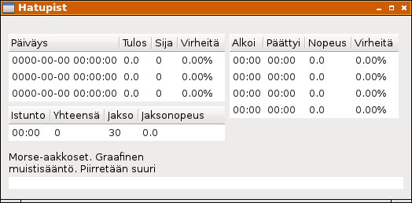

# Tulostaulut

Ohjelman ajatus on, että kirjoitusnopeuden mittaus jaetaan puolen minuutin intervalleihin (jatkossa i-etuliite nimissä). Varsinainen tulos on neljän peräkkäisen intervallin merkkimäärien summa, eli kahden minuutin jakso. Tuloksia ylläpitävä tietorakenne on nimeltään `Result` (`r`-etuliite nimissä). Istunnolla (Session, `s`-etuliite) puolestaan tarkoitetaan ajanjaksoa ensimmäisen merkin syöttämisestä ikkunan sulkemiseen, tietorakenne `Timing`.

```
iDuration = 30
rDuration = 120
amountOfIntervals = rDuration `div` iDuration

data Result = Result { 
  rDate :: String, 
  rMrks, rRank, rErrs :: Int
} deriving (Read, Show)

zeroResult = Result {
  rDate = "0000-00-00 00:00:00", 
  rMrks = 0, rRank = 0, rErrs = 0 }

data Timing = Timing {
  sSession :: String, sTotal :: Int, 
  sSecsLeft :: Int,   sSpeed :: Double
} deriving Show

zeroTiming = Timing {
  sSession = "00:00", sTotal = 0,
  sSecsLeft = iDuration, sSpeed = 0.0 }

data Interval = Interval {
  iNum, iMrks, iErrs :: Int 
} deriving Show

zeroInterval = Interval {
  iNum = -1, iMrks = 0, iErrs = 0 }
```

Näitä kolmea tietorakennetta kohden on oma tulostaulunsa ohjelman ikkunassa. Tulostauluun luotava alustava malli, sarakkeiden otsikot ja tätä vastaava funktio solun sisällön tulostamiseksi on määritelty seuraavassa:

```
rInitModel = replicate 3 zeroResult
rColTitles = ["Päiväys", "Tulos",         "Sija",        "Virheitä" ]
rColFuncs  = [ rDate,     rSpeed . rMrks,  show . rRank,  rErrorPros]

sInitModel = [zeroTiming]
sColTitles = ["Istunto", "Yhteensä",     "Jakso",          "Jaksonopeus"]
sColFuncs  = [ sSession,  show . sTotal,  show . sSecsLeft, f01 . sSpeed]

iInitModel = replicate amountOfIntervals zeroInterval
iColTitles = ["Alkoi",        "Päättyi",    "Nopeus",       "Virheitä" ]
iColFuncs  = [ iStarts . iNum, iEnds . iNum, iSpeed . iMrks, iErrorPros]
```

Käyttöliittymä luodaan tuttuun tapaan funktiossa `createGUI`:

```
createGUI = do
  window <- windowNew
  onDestroy window mainQuit

  outerVBox  <- vBoxNew False 0
  middleHBox <- hBoxNew False 0
  innerVBox1 <- vBoxNew False 0
  innerVBox2 <- vBoxNew False 0

  rModel <- setupView rInitModel rColTitles rColFuncs innerVBox1
  sModel <- setupView sInitModel sColTitles sColFuncs innerVBox1
  iModel <- setupView iInitModel iColTitles iColFuncs innerVBox2

  boxPackStart middleHBox innerVBox1 PackNatural 0
  boxPackStart middleHBox innerVBox2 PackNatural 6
  boxPackStart outerVBox middleHBox PackNatural 10

  set window [
    containerBorderWidth := 10,
    windowTitle := "Hatupist",
    containerChild := outerVBox ]

  label1 <- labelNew (Just xxx)
  miscSetAlignment label1 0 0
  boxPackStart outerVBox label1 PackNatural 0

  label2 <- labelNew (Just xxx)
  miscSetAlignment label2 0 0
  boxPackStart outerVBox label2 PackNatural 0

  textview <- textViewNew
  boxPackStart outerVBox textview PackNatural 3
  buffer <- textViewGetBuffer textview

  widgetShowAll window
  
  return GUI {
    gBuffer = buffer,
    gLabel1 = label1,
    gLabel2 = label2
  }
```

Tulostaulujen näkymä luodaan funktiolla `setupView`, joka tässä vaiheessa näyttää seuraavalta:

```
setupView initModel titles funcs parent = do
  model <- listStoreNew (initModel)
  view  <- treeViewNewWithModel model
  mapM 
    ( \(title, func) -> newcol view model title func )
    ( zip titles funcs )
  set view [ widgetCanFocus := False ]
  boxPackStart parent view PackNatural 3
  return model
  where
    newcol view model title func = do
      renderer <- cellRendererTextNew
      col <- treeViewColumnNew
      cellLayoutPackStart col renderer True
      cellLayoutSetAttributes col renderer model (
        \row -> [ cellText := func row])
      treeViewColumnSetTitle col title
      treeViewAppendColumn view col
```

Solutekstien muotoilemiseen on erinäinen määrä apufunktioita, joiden toimintalogiikkaan ei tässä vaiheessa kannattane kiinnittää suurempaa huomiota:

```
rErrorPros rR = 
  f02p (errorPros (rErrs rR) (rMrks rR))

iErrorPros iV = 
  f02p (errorPros (iErrs iV) (iMrks iV))

errorPros errs mrks 
  | errs == 0 && mrks == 0 = 0.0
  | errs /= 0 && mrks == 0 = 100.0
  | otherwise = 100.0 * (intToDouble errs) / (intToDouble mrks)

f01 :: Double -> String
f01 = printf "%.1f"

f02p :: Double -> String
f02p = printf "%.2f%%"

iSpeed mrks = 
  f01 ((intToDouble mrks)* 60.0 / intToDouble iDuration)

rSpeed mrks = 
  f01 ((intToDouble mrks)* 60.0 / intToDouble rDuration)

iStarts n
  | n <= 0    = "00:00"
  | otherwise = mmss (fromIntegral (n*iDuration) :: Double)

iEnds n = iStarts (n+1)

mmss seconds =
  leadingZero (show (floor seconds `div` 60)) ++ 
  ":" ++ 
  leadingZero (show (floor seconds `mod` 60))

leadingZero s
  | length s < 2 = "0" ++ s
  | otherwise    = s

intToDouble :: Int -> Double
intToDouble i = fromRational (toRational i)
```

Ohjelman tuottama ikkuna näyttää nyt tältä:


