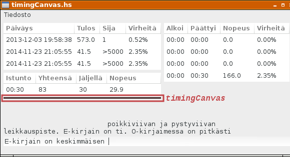

# Tulosilmaisimen väriteema

Tulos mitataan puolen minuutin välein. Lisäämme ohjelmaan pienen ilmaisimen osoittamaan mittaushetken. Ilmaisimen väri ilmaisee kuinka korkealle tuloksissa mitattu tulos sijoittuu.

Kokeilemme väriteemaa erillisessä ohjelmassa, jonka laadimme seuraavaksi. 

Värikoodi määräytyy kakkosen logaritmina HSV-värisävyinä. Kylläisyys (Saturation) määritellään vakioksi 0.40. Värisävy (Hue) vaihtelee nollasta ykköseen, likimäärin valon spektrin tavoin. Kirkkaus (Value) vaihtelee välillä (1.00, 0.25).

Tulos väliltä (0,5000) muunnetaan logaritmisena välille (0.00, 12.3).

```
hueLimits  = (0.00, 1.00)
valLimits  = (1.00, 0.25)
limitsFrom = (0.00, 12.3)
```


```
$ ghci
Prelude> [2^x | x <- [0..12]]
[1,2,4,8,16,32,64,128,256,512,1024,2048,4096]
```

Kun värin HSV-arvo on selvillä, piirretään indikaattori Cairon piirtotoimenpiteiden avulla.

```
drawColorLine hue sat val = do
  let (r,g,b) = hsvToRgb (hue,sat,val)
      text = "hue="++(f02 hue)++"  sat="++(f02 sat)++"  val="++(f02 val)
  setSourceRGB r g b
  rectangle 40 10 300 3
  fill
  rectangle 10 10 20 20
  fill
  setSourceRGB 0 0 0
  rectangle 10 10 20 20
  stroke
  paintText 40 17 text
```

Myös kuvatekstit piirretään Cairon funktioilla.

```
paintText x y text = do
  fntDscr <- liftIO (fontDescriptionFromString "Sans 8")
  layout <- createLayout (text)
  liftIO (layoutSetFontDescription layout (Just fntDscr))
  moveTo x y
  setSourceRGB 0 0 0
  showLayout layout
```

Pienet laatikot piirretään funktiolla `renderWithDrawable`, arvoilla, jotka saadaan aiemmin kuvatulla laskukaavalla.

```
drawCanvas2 canvas _evt = do
  dw <- widgetGetDrawWindow canvas
  mapM
    (\(y,twoToY) -> renderWithDrawable dw (drawBox y twoToY))
    [(y, 2.0**y) | y <- [0.00..12.00]]
  return True
```
Yksittäinen laatikko piirretään Cairon piirtotoimenpiteiden avulla funktiossa `drawBox`.

```
drawBox y rankD = do
  let colorPoint = logBase 2.0 rankD
      sat = 0.40
      hue = ptAlong hueLimits limitsFrom colorPoint
      val = ptAlong valLimits limitsFrom colorPoint
      (r,g,b) = hsvToRgb (hue,sat,val)
  setSourceRGB r g b
  rectangle 10 (10+y*24) 20 20
  fill
  setSourceRGB 0 0 0
  rectangle 10 (10+y*24) 20 20
  stroke
  paintText 40 (13+y*24) (show (round (rankD)))
```

Ohjelman lähdekoodi: [resultColorTheme.hs](resultColorTheme.hs)

# Tulosilmaisin pääohjelmassa

Luomme tulosilmaisimen piirtoalueen `timingCanvas` muiden graafisten komponenttien yhteydessä funktiossa `createGUI`. Tulosilmaisin on 3 pikselin korkuinen, kapea leveä yksivärinen raita, joka näytetään lyhyen hetken ajan aina puolen minuutin välein. Sen leveys skaalautuu riippuen yläpuolella olevien taulukoiden leveydestä, ollen kuitenkin vähintään 120 pikseliä.

```
  timingCanvas <- drawingAreaNew
  widgetSetSizeRequest timingCanvas 120 3
  onExpose timingCanvas (
    drawTimingCanvas gsRef timingCanvas)
  boxPackStart innerVBox1 timingCanvas PackNatural 0
```

Aktivoimme tulosilmaisimen piirron harvoin päivitettävien taulujen uudelleenpiirron yhteydessä.

```
renewSeldomTables gs iCur = do
  (newGs, shownRs) <- renewTableI gs iCur
  renewTableR newGs shownRs
  widgetQueueDraw (gTimingCanvas (g gs))
  return newGs { showTimingPict = True }
```

Tarvitsemme pääohjelman tilassa tiedon tulosilmaisimen näkyvyydestä. Kenttä `showTimingPict` on tyyppiä `Bool`, ja saa oletuksena arvon `False`.

Ilmaisimen piirron olemme jo käyneet suurelta osin lävitse. Ilmaisin piirretään jos kenttä `showTimingPict` on saanut arvon `True`, muutoin sitä ei piirretä. Funktio `drawEmptyPicture` on sama kuin virhekuviota piirrettäessä, ainoastaan parametri `canvas` osoittaa tulosilmaisimen piirtoalueelle eikä virhekuvion piirtoalueelle.

```
drawTimingCanvas gsRef canvas _evt = do
  gs <- readIORef gsRef
  if (showTimingPict gs)
    then drawTimingPicture gs canvas
    else drawEmptyPicture canvas
  writeIORef gsRef gs { showTimingPict = False }
  return True

hueLimits  = (0.00, 1.00)
valLimits  = (1.00, 0.25)
limitsFrom = (0.00, 12.3)

ptAlong limitsTo limitsFrom pointFrom =
  to0 + distTo*((ptFrom - from0)/distFrom)
  where
    (to0,to1) = limitsTo
    distTo = to1 - to0
    (from0,from1) = limitsFrom
    distFrom = from1 - from0
    ptFrom = from0 `max` pointFrom `min` from1

drawTimingRect w h (r,g,b) = do
  rectangle 0 0 w h
  setSourceRGB r g b
  fill

drawTimingPicture gs canvas = do
  row <- listStoreGetValue (gModelR (g gs)) 2
  (wInt,hInt) <- widgetGetSize canvas 
  drawWin <- widgetGetDrawWindow canvas
  let (w,h) = (intToDouble wInt, intToDouble hInt)
      rankD = intToDouble (rRank row)
      colorPoint = logBase 2.0 rankD
      sat = 0.40
      hue = ptAlong hueLimits limitsFrom colorPoint
      val = ptAlong valLimits limitsFrom colorPoint
      (r,g,b) = hsvToRgb (hue,sat,val)
  renderWithDrawable drawWin (drawTimingRect w h (r,g,b))
  timeoutAdd (onTimeToClear canvas) 1000
  return True
```

Tulosilmaisimen piirto käynnistää ajastimen, joka laukeaa sekunnin kuluttua piirtämisestä.

```
  timeoutAdd (onTimeToClear canvas) 1000
```

Tällöin kutsutaan funktiota `onTimeToClear`.

```
onTimeToClear canvas = do
  widgetQueueDraw (canvas)
  return False
```



Ohjelmakoodi kokonaisuudessaan: [timingCanvas.hs](timingCanvas.hs)

