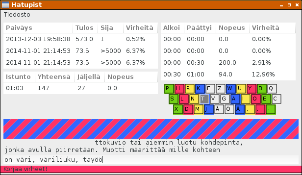

# Hatupist

Hatupist on ohjelma kirjoitusnopeuden harjoitteluun. Se on kirjoitettu Haskell-kielellä ja käyttää Gtk2hs-käyttöliittymäkirjastoa.

Hakemistossa
[/MakingOf](/MakingOf)
voit seurata kuinka ohjelma valmistuu pala palalta.

Typing speed practice program using Gtk2hs and Haskell. The most recent one is `hatupist-103.hs`. You can run it in interpreted mode by `runhaskell hatupist-103.hs`.

You can follow the 
[Making Of](/MakingOf)
to see how the program gets constructed piece by piece. Currently only in finnish.

