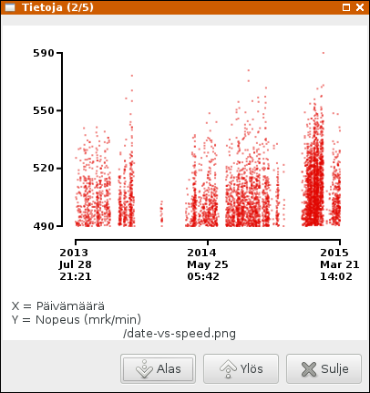

# Tietoja-dialogi

Asetamme päävalikon valinnan `gtk-about` ("Tietoja...") kutsumaan funktiota `showResultPics`. Se avaa dialogi-ikkunan, joka esittää tulosten kuvaajat.

```
menuBarDescr = 
  [("_Tiedosto", 
    [("gtk-open", openFile),
     ("gtk-select-font", openFont),
     ("gtk-preferences", setPreferences),
     ("gtk-about", showResultPics),
     ("gtk-quit", quitProgram)])
  ]
```

Toteutamme kuvaajien piirron myöhemmin. Dialogi-ikkuna esittää kerrallaan yhden kuvaajan. Valinnat "Alas" ja "Ylös" avaavat uuden dialogi-ikkunan uudella kuvaajalla. Painikkeiden palautusarvot ovat `ResponseUser 1` ja `ResponseUser (maxNum-1)`. Uusi dialogi-ikkuna luodaan komennolla `showResultDialog titles files ((num + n) mod maxNum`. Valinnan "Sulje" palautusarvo on `ResponseDeleteEvent`. Esc-näppäimen palautusarvo dialogi-ikkunoissa on oletusarvoisesti `ResponseDeleteEvent`.

```
showResultDialog titles files num = do
  dialog <- dialogNew
  let maxNum = length framelist
  set dialog [ 
    windowTitle := "Tietoja (" ++ show (num+1) ++ "/" ++ show maxNum ++ ")"]
  upbox <- dialogGetUpper dialog
  vbox1 <- vBoxNew False 0
  createFrame vbox1 (titles !! num) (files !! num)
  boxPackStart upbox vbox1 PackNatural 0

  dialogAddButton dialog stockGoDown (ResponseUser 1)
  dialogAddButton dialog stockGoUp (ResponseUser (maxNum-1))
  dialogAddButton dialog stockClose ResponseClose
  widgetShowAll upbox
  response <- dialogRun dialog
  widgetDestroy dialog
  case response of
    ResponseUser n -> showResultDialog titles files ((num + n) `mod` maxNum)
    _ -> return ()
  return () 

showResultPics gsRef = do
  gs <- readIORef gsRef
  let 
    valuess = [(
      picName fn gs,
      s,collectResults x y c (r gs)) | (fn,s,x,y,c) <- framelist]
    (w,h)  = picSize (s gs)
    titles = [s | (_,s,_,_,_) <- framelist]
    files  = map (\m -> picName m gs) [f | (f,_,_,_,_) <- framelist]
  mapM (\(fn,s,v) -> createImage fn w h draw1 v) valuess
  showResultDialog titles files 0
  return () 
```




