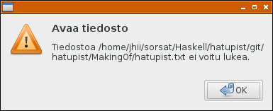

# Kun tiedoston luku ei onnistu

Kirjoitettavaksi tarkoitettu tekstitiedosto on tähän saakka luettu funktiolla `readFile`.

```
  originalText <- readFile (textfile (s gs))
```

Kun tiedostoa ei löydy, seurauksena on virheilmoitus päätteelle ja ohjelman suorituksen keskeytyminen. Varaudumme tähän ongelmaan määrittelemällä funktion `tryReadFile`, jota kutsumme funktion `readFile` sijasta.

```
  originalText <- tryReadFile (textfile (s gs))

tryReadFile fname = do
  text <- readFile fname `catch` 
    \(SomeException e) -> ( do 
      dialog <- messageDialogNew Nothing [] MessageWarning ButtonsOk 
        "Avaa tiedosto"
      messageDialogSetSecondaryText dialog 
        ("Tiedostoa " ++ fname ++ " ei voitu lukea.")
      dialogRun dialog
      widgetDestroy dialog
      return (unlines proverbs))
  return text
```

Funktio `tryReadFile` kutsuu yhä edelleen funktiota `readFile`, mutta funktion `catch` ensimmäisenä parametrina, jolloin funktion suorituksen epäonnistuessa nostettuun poikkeukseen vastataan dialogi-ikkunalla.



Virhetilanteessa luemme tekstiriveiksi latinankielisiä sananlaskuja, jotka määrittelemme ohjelmassa.

```
proverbs = [
  "Castigat ridendo mores.",
  "Vulpes pilum mutat, non mores!",
  "Aut viam inveniam aut faciam.",
  "Qui multum habet, plus cupit.",
  "Praestat cautela quam medela.",
  "Mali principii malus finis.",
  "Iucundum est narrare sua mala.",
  "Imperare sibi maximum imperium est.",
  "Qui non proficit, deficit.",
  "Quien me amat, amet et canum meum.",
  "Dives est qui sibi nihil deesse putat."
  ]
```

Ohjelmakoodi: [fileError.hs](../code/fileError.hs)

