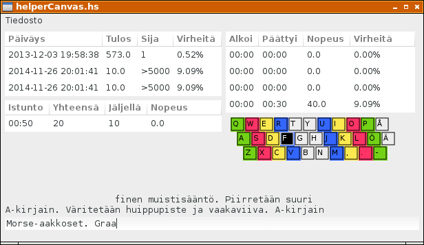

# Avustava näppäimistö

Aloittelijoita varten laadimme ruudulle kuvan, joka näyttää seuraavan kirjoitettavan kirjaimen paikan näppäimistöllä. Komponentin nimi on `gHelperCanvas` ja se on tyyppiä `DrawingArea`.

```
data GUI = NotCreated | GUI {
  gWindow :: Window,
  gErrorCanvas, gTimingCanvas, gHelperCanvas :: DrawingArea,
  ...
}
```

Näppäimistöä varten tallennamme ohjelman tilatietueeseen kentät `lastLetter` ja `nextLetter`, jotka ovat tyyppiä `Char` ja pitävät sisällään edellisen ja seuraavan kirjoitettavan merkin.

```
data State = State {
  lastLetter,nextLetter :: Char,
  ...
}
```

Avustava näppäimistö on valinnainen, joten lisäämme asetuksiin kentän `useHelper`, joka saa arvon `True` silloin kun näppäimistö halutaan näyttää ja arvon `False` silloin kun näppäimistöä ei näytetä. Samoin varaamme käyttäjälle mahdollisuuden muuttaa näppäimistöjärjestystä. Näppäimistön rivit talletetaan merkkijonoina muuttujiin `keyrow1`, `keyrow2` ja `keyrow3`.

```
data Settings = Settings {
  ...
  useHelper :: Bool,
  keyrow1,keyrow2,keyrow3 :: String
} 
```

Oletuksena näppäimistö näytetään ja näppäinrivit otetaan QWERTY-näppäimistöltä. Näppäimet väritetään vihreällä, punaisella, keltaisella tai sinisellä, riippuen siitä minkä sormen alueelle ne QWERTY-näppäimistöön perustuen kuuluvat.

```
defaultSettings = Settings {
  useHelper = True,
  keyrow1 = keyboard !! 0,
  keyrow2 = keyboard !! 1,
  keyrow3 = keyboard !! 2
}

keyboard = qwerty

qwerty = [
  "qwertyuiopå",
  "asdfghjklöä",
  " zxcvbnm,.-"]

qwertyAreas = ["rfvujm", "edcik,", "wsxol.", "qazpö-"]
areaColors  = [blue, yellow, red, green]

```

Ikkunassa avustavalle näppäimistölle varataan 275x73 pikselin tila ja piirtämisestä huolehtiva tapahtumankäsittelijä `onExpose` kutsuu funktiota `drawKeyrowsCanvas`.

```
  keyrowsCanvas <- drawingAreaNew
  widgetSetSizeRequest keyrowsCanvas 275 73
  onExpose keyrowsCanvas (
    drawKeyrowsCanvas gsRef keyrowsCanvas)
  boxPackStart innerVBox2 keyrowsCanvas PackNatural 0
```

Piirtorutiinit on määriteltynä seuraavassa. Ne käyttävät tuttuja Cairon piirtofunktioita.

```
qwertyColor letter =
  if null as then Nothing else Just (areaColors !! (head as))
  where
    as = [a |(a,i) <- zip [0..] qwertyAreas, letter `elem` i]

qwertyLetter x y =
  if y < length qwerty && x < length (qwerty!!y)
    then (qwerty !! y) !! x
    else ' '

drawRect x y r1 (r,g,b) filled = do
  rectangle x y r1 r1
  setSourceRGB r g b
  if filled then fill else stroke

paintLetter x y letter (r,g,b) = do
  fntDscr <- liftIO (fontDescriptionFromString "Sans 8")
  layout <- createLayout (letter)
  liftIO (layoutSetFontDescription layout (Just fntDscr))
  moveTo x y
  setSourceRGB r g b
  showLayout layout

drawKey x y letter selected dupl = do
  setLineWidth 1.0
  let co = qwertyColor(qwertyLetter x y)
      botColor = if selected then white else black
      selColor = if dupl     then gray  else black
  case co of
    Just c -> drawRect (intToDouble (zentr xx)) 
                       (intToDouble (zentr yy)) 
                       (intToDouble r2)
                       c True
    Nothing -> return ()
  when selected (drawRect (intToDouble xx) 
                          (intToDouble yy) 
                          (intToDouble r1)
                          selColor True)
  drawRect (intToDouble xx) (intToDouble yy) (intToDouble r1) botColor False
  paintLetter (intToDouble (xx+2)) (intToDouble (yy+2)) letter botColor
  where
    r1 = 18
    r2 = 21
    zentr z = z - (r2-r1) `div` 2
    deltaXs = [3,12,0]
    margin = 5
    xx = x*r2+deltaXs!!y + margin
    yy = y*r2            + margin

drawKeyrowsCanvas gsRef canvas _evt = do 
  gs <- readIORef gsRef
  writeIORef gsRef gs {
    lastLetter = nextLetter gs
  }
  let c = nextLetter gs
      selected = [toUpper c]
      dupl = toUpper c == toUpper (lastLetter gs)
      keymap = [keyrow1 (s gs), keyrow2 (s gs), keyrow3 (s gs)] 
      leK y = length (keymap !! y)
      keyK x y = [toUpper ((keymap !! y) !! x)]
  drawWin <- widgetGetDrawWindow canvas
  renderWithDrawable drawWin (do
    mapM 
      ( \(x,y,k) -> drawKey x y k (k == selected) dupl)
      [(x,y,keyK x y)| y <- [0..2], x <- [0..(leK y)-1], keyK x y /= " "]
    return True)
```
Funktio `toUpper` saadaan kirjastosta `Data.Char`.

Avustavan näppäimistön uudelleenpiirtoa pyydetään tapahtumankäsittelijässä `whenEntryChanged`, jossa myös päätellään seuraava väritettävä näppäin.

```
nextChar n str = 
  head (drop n (str ++ " "))

whenEntryChanged gsRef = do
  ...
  writeIORef gsRef newGs {
    ...
    nextLetter = nextChar cprfix label1Str
    }
  ...
  widgetQueueDraw (gHelperCanvas (g gs))
  ...
```
Rivin vaihtuessa ja ohjelman käynnistyessä seuraava näppäin on ensimmäisen tekstirivin ensimmäinen kirjain.

```
   nextLetter = head ((labelStrs !! 0) ++ " ")
```



Ohjelmakoodi: [helperCanvas.hs](../code/helperCanvas.hs)

