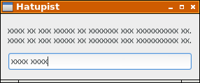

# Hatupist

Hatupist on kirjoitusnopeuden harjoitusohjelma. Rakennamme ohjelman alkaen tyhjästä ikkunasta. Käytämme Haskell-ohjelmointikieltä ja Gtk2hs-käyttöliittymäkirjastoa.

# Tyhjä ikkuna

Seuraava ohjelma avaa yksinkertaisen tyhjän ikkunan:

```
import Graphics.UI.Gtk

main = do
  initGUI
  window <- windowNew
  onDestroy window mainQuit
  widgetShowAll window
  mainGUI
```

Funktio `onDestroy` on tapahtumankäsittelijä, joka määrittää ikkunan käyttäytymisen suljettaessa ikkuna esimerkiksi hiirellä ruksia naksautettaessa. Toimenpide yhdistetään funktioon `mainQuit`, joka on ohjelman lopetuskomento.

Tallenna ohjelma nimellä `plain-ui.hs` ja anna pääteikkunaan komento `runhaskell plain-ui.hs`. Ohjelma käynnistyy tulkattavassa muodossa ja tuottaa seuraavan ikkunan ruudulle: 


# Yksinkertainen käyttöliittymä

Katsotaan seuraavaksi tiedostoa [plain-ui-002.hs](../code/plain-ui-002.hs)

Ajettaessa komennolla `runhaskell plain-ui-002.hs` ohjelma tuottaa seuraavan ikkunan:



Ohjelma sisältää kaksi tyypin `Label` komponenttia ja tekstikentän tyyppiä `Entry`. Ne luodaan funktioilla `labelNew` ja `entryNew`. Komponentit sijoitetaan vertikaaliseen laatikkoon `vbox` joka luodaan funktiolla `vBoxNew`. Näiden lisäksi käytetään erottimia `sep1` ja `sep2` tyhjän tilan saamiseksi komponenttien väliin. Erottimet luodaan funktiolla `hSeparatorNew`. Kukin komponentti paketoidaan vertikaaliseen laatikkoon `vbox` funktiolla  `boxPackStart`.

Esimerkkinä tyypin `Label` komponentti:

```
  label1 <- labelNew (Just xxx)
  miscSetAlignment label1 0 0
  boxPackStart vbox label1 PackNatural 0
```
# Tekstikentän asettelua

Kuvassa näkyvän tekstikentän sinisen reunuksen saamme pois komennolla

```
  entrySetHasFrame entry False
```

Lisäksi haluamme tekstirivit täsmällisesti allekkain. Siirrämme tekstiä kahdella pikselillä oikealle:

```
  miscSetPadding   label1 2 0
  miscSetPadding   label2 2 0
```

Emme tarvitse myöskään erottimia tekstikenttien väliin, joten poistamme ne.


Ohjelmakoodi tähän mennessä: [plain-ui-003.hs](../code/plain-ui-003.hs)

