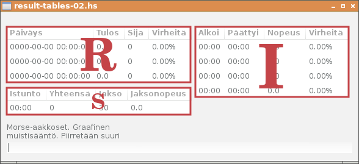

# Tulostaulut R, S ja I



Tulostauluja on siis kolme, näistä istunnon S-taulu päivitetään puolen sekunnin välein. Kaksi muuta taulua päivitetään, kun siirrytään intervallista toiseen. Monadin sisällä tämä ehtolause ei ole kovin selkeästi luettava, mutta se on seuraavassa:

```
renewTables gui gs t iCur = do
  renewTableS gui gs t 
  newGs <- if (lastShownIv gs /= iCur)
  then renewSeldomTables gui gs iCur
  else return gs
  return newGs
```

Intervallien I-taulun päivityksen yhteydessä lasketaan kahden minuutin tulos ja siivotaan pois tarpeettomat intervallit:

```
renewTableI gui gs iCur = do
  mapM 
    (\(a,b) -> listStoreSetValue (gModelI gui) (amountOfIntervals-a) b) 
    (zip [1..] showIvs)
  return gs {
    intervals = newIvs,
    lastShownIv = iCur,
    results = [zeroResult {
       rMrks = sum [iMrks g | g <- showIvs]
    }]
  }
  where
    iMaxShow = iCur - 1
    infimum = iMaxShow - amountOfIntervals + 1
    iMinShow = max 0 infimum
    iMinNeed = max 0 (infimum + 1)
    newIvs = ivsFrom iMinNeed (intervals gs)
    showIvs = reverse (ivsAllBetween iMinShow iMaxShow (intervals gs))
```

Näytettävien intervallien alaraja on muuttuja `iMinShow` ja yläraja `iMaxShow`. Seuraavaan kertaan näistä ei tarvitse säilyttää alarajan intervallia, joten tarvittavien intervallien alaraja `iMinNeed` on yhden korkeampi. Uudet intervallit ovat nyt siis taulukossa `newIvs` ja näytettävät intervallit taulukossa `showIvs`. Kahden minuutin tulos saadaan laskemalla merkkimäärät näytettävistä intervalleista kaavalla

```
rMrks = sum [iMrks g | g <- showIvs]
```

Tässä vaiheessa heitämme tuon laskun tuloksen yksinkertaisesti tulosten R-taulun alimmalle riville:

```
latestResult results = if null results 
  then zeroResult
  else head results

renewTableR gui gs iCur = do
  listStoreSetValue (gModelR gui) 2 (latestResult (results gs))
  return ()
```

Pienet apufunktiot, joita käytämme intervallien suodattamiseen, ovat esitettynä seuraavassa. Intervalleihin ei taltioidu nollatuloksia, mutta I-taulussa ne halutaan näyttää, ja tästä syystä määrittelemme funktiot `ivsAllBetween` ja `ivExactly`.

```
ivsBetween iMin iMax ivs =
  filter (\iv -> iMin <= (iNum iv) && (iNum iv) <= iMax) ivs

ivsFrom iMin ivs =
  filter (\iv -> iMin <= (iNum iv)) ivs

ivsAllBetween iMin iMax ivs =
  [ivExactly n ivs | n <- [iMin .. iMax]]

ivExactly n ivs =
  case find (\iv -> n == (iNum iv)) ivs of
    Just x  -> x
    Nothing -> zeroInterval { iNum = n }
```

Kirjoitusnopeus kauniissa muodossa merkkijonona esitettynä saatiin jakamalla merkkimäärä aikavälin pituudella (mrk/min, jossa 1min=60.0s).

```
rSpeed mrks = 
  f01 ((intToDouble mrks)* 60.0 / intToDouble rDuration)
```

Funktiota `addTime` on myös hieman muutettu. Se sisältää nyt tarkistuksen tyhjän taulukon varalta.

```
addTime status i intervals =
  [newHead] ++ tail newIvs
  where
  newHead = case status of
    Correct -> headIv { iMrks = (iMrks headIv) + 1 }
    Error   -> headIv { iErrs = (iErrs headIv) + 1 }
  headIv = head newIvs
  newIvs = if null intervals || i /= latestIvNum intervals
    then [zeroInterval { iNum = i }] ++ intervals
    else intervals
```

Ohjelmakoodi: [result-tables-02.hs](../code/result-tables-02.hs)

