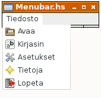

# Parametrit tietorakenteena

Kun siirrämme graafisen käyttöliittymän, asetukset ja tekstirivit tietorakenteeseen `State`, vähenevät välitettävät parametrit funktiokutsuissa ja ohjelmasta tulee luettavampi.

Esimerkiksi funktio

```
whenEntryChanged gui settings lines gsRef 
```

voidaan esittää muodossa

```
whenEntryChanged gsRef 
```

Tietorakenne State sisältää nyt muun muassa seuraavat kentät:

```
data State = State {
  textLines :: [String],
  speedNows :: [(POSIXTime, Int)],
  intervals :: [Interval],
  results :: [Result],
  settings :: Settings,
  gui :: GUI
}
```

Tämän lisäksi määrittelemme lyhennysmerkinnät

```
s gs = settings gs
g gs = gui gs
r gs = results gs
```

Voimme nyt kutsua tietorakenteen `State` sisältämiä kenttiä seuraavaan tapaan:

```
textfile (s gs)
lineLen (s gs)
gModelR (g gs)
gEntry (g gs)
...
```

Piilotamme määrittelyn `Settings` kirjastosta `Graphics.UI.GTK`, koska haluamme käyttää sitä muihin tarkoituksiin.

```
import Graphics.UI.Gtk hiding (Settings)
```

# Päävalikko

Luomme ohjelmaan myös valikon, josta voi valita kirjoitettavan tiedoston, kirjasimen, asettaa muita asetuksia, nähdä tulosten kehitys ja lopettaa ohjelman. Tietoja-valikko eli tulosten kehitys jätetään toistaiseksi toteuttamatta, eli se on `noop`. Päävalikon valintamahdollisuudet on kerätty standardivalikkoteksteinä, joten ne suomentuvat ja saavat oikean kuvakkeen automaattisesti.



```
menuBarDescr = 
  [("_Tiedosto", 
    [("gtk-open", openFile),
     ("gtk-select-font", openFont),
     ("gtk-preferences", setPreferences),
     ("gtk-about", noop),
     ("gtk-quit", quitProgram)])
  ]

createMenuBar descr gsRef = do 
  bar <- menuBarNew
  mapM_ (createMenu bar) descr
  return bar
  where
    createMenu bar (name,items) = do 
      menu <- menuNew
      item <- menuItemNewWithLabelOrMnemonic name
      menuItemSetSubmenu item menu
      menuShellAppend bar item
      mapM_ (createMenuItem menu) items
    createMenuItem menu (stock,action) = do 
      item <- imageMenuItemNewFromStock stock
      menuShellAppend menu item
      onActivateLeaf item (do action gsRef)
    menuItemNewWithLabelOrMnemonic name
      | elem '_' name = menuItemNewWithMnemonic name
      | otherwise     = menuItemNewWithLabel name

noop gsRef = do
  return ()
```

# Kirjasindialogi

Kirjasin vaihdetaan valitsemalla päävalikosta kirjasindialogi. Kirjasindialogi on yksinkertainen ikkuna, jossa käyttäjältä kysytään uuden kirjasimen tiedot.

```
openFont gsRef = do
  gs <- readIORef gsRef
  result <- chooseFont "Valitse kirjasin" (font (s gs))
  case result of
    Just newFont -> do
      writeIORef gsRef gs {
        settings = (s gs) {
          font = newFont }}
      setFonts gsRef
    otherwise -> return ()

chooseFont prompt oldFont = do
  dialog <- fontSelectionDialogNew prompt
  fontSelectionDialogSetFontName dialog oldFont
  widgetShow dialog
  response <- dialogRun dialog
  print response
  case response of
    ResponseOk -> do
      fn <- fontSelectionDialogGetFontName dialog
      widgetDestroy dialog
      return fn
    ResponseCancel -> do
      widgetDestroy dialog
      return Nothing
    ResponseDeleteEvent -> do
      widgetDestroy dialog
      return Nothing
    _ -> return Nothing

```

Aikaisemmin huomiotta jäänyt asia on, että vanhojen tulosten sijoitukset luonnollisesti muuttuvat kun uusia syntyy. Tulokset on siis järjestettävä uudelleen:

```
reRank1 (Result { rDate = a, rMrks = b, rRank = c, rErrs = d }, newRank) =
  Result { rDate = a, rMrks = b, rRank = newRank, rErrs = d }

reRank rs = map reRank1 (zip rs [1..])
```

Ohjelmakoodi kokonaisuudessaan: [settings.hs](../code/settings.hs)

