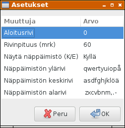

# Asetusdialogi

Asetuksista olemme tähän mennessä määritelleet kentät aloitusriville, rivinpituudelle, tekstitiedoston nimelle, kirjasimelle sekä näytetäänkö apunäppäimistö ja apunäppäimistön merkkijärjestys.

```
data Settings = Settings {
  startLine :: Int,
  lineLen :: Int,
  textfile :: String,
  font :: String,
  useHelper :: Bool,
  keyrow1,keyrow2,keyrow3 :: String
} deriving (Read, Show)

defaultSettings = Settings {
  startLine = 0,
  lineLen = 60,
  textfile = "morse.txt",
  font = "monospace 10",
  useHelper = True,
  keyrow1 = keyboard !! 0,
  keyrow2 = keyboard !! 1,
  keyrow3 = keyboard !! 2
}
```

Asetusdialogi tulee sisältämään taulukon, johon edellä esitellyt arvot sijoitetaan.



Määrittelemme suomenkieliset otsikot taulukolle sekä tavan totuusarvojen `True` ja `False` esittämiselle.

```
colTitle = ["Muuttuja", "Arvo"]

showBool True  = "Kyllä"
showBool False = "Ei"
```

Taulokon sisältö määräytyy olemassaolevien asetusten mukaisesti. Kokonaislukuarvot `startLine` ja `lineLen` näytetään merkkijonona funktion `show` avulla ja totuusarvo edellä kuvatun mukaisesti vaihtoehdoilla Kyllä/Ei. Muuttujat `textfile` ja `font` asetetaan suoraan päävalikosta, joten nämä arvot jätämme huomitta (merkintätapana alaviiva).

```
settingsTable (Settings a b _ _ c e f g) = [
  ["Aloitusrivi",            show a],
  ["Rivinpituus (mrk)",      show b],
  ["Näytä näppäimistö (K/E)",showBool c],
  ["Näppäimistön ylärivi",   e],
  ["Näppäimistön keskirivi", f],
  ["Näppäimistön alarivi",   g] ]
```

Varsinainen dialogi-ikkuna määritellään standardinmukaisesti. Kun käyttäjä sulkee dialogi-ikkunan painamalla OK-näppäintä, otetaan uudet asetukset käyttöön, muutoin palataan vanhoihin.

```
setPreferences gsRef = do
  oldGs <- readIORef gsRef
  result <- preferencesDialog "Asetukset" oldGs gsRef
  case result of
    Just "OK" -> do
      newGs <- readIORef gsRef
      when ((lineLen   (s oldGs)) /= (lineLen   (s newGs))) (getLines gsRef)
      when ((startLine (s oldGs)) /= (startLine (s newGs))) (renewLabels gsRef)
      afterConfig gsRef
    otherwise -> do
      writeIORef gsRef oldGs
```

Dialogi-ikkunan graafinen ulkoasu näppäimineen on määritelty seuraavassa:

```
preferencesDialog title gs gsRef = do
  dialog <- dialogNew
  set dialog [ windowTitle := title ]
  dialogAddButton dialog stockCancel ResponseCancel
  dialogAddButton dialog stockOk ResponseOk

  model <- listStoreNew (settingsTable (s gs))
  view  <- treeViewNewWithModel model
  setupSettingsView gsRef view model

  upbox <- dialogGetUpper dialog
  boxPackStart upbox view PackNatural 10
  widgetShowAll upbox
  response <- dialogRun dialog
  widgetDestroy dialog
  case response of
    ResponseOk -> do
      return (Just "OK")
    ResponseCancel -> do
      return Nothing
    ResponseDeleteEvent -> do
      return Nothing
    _ -> return Nothing
```

Esitettävä taulukko on komponentti tyyppiä `TreeView`.

```
setupSettingsView gsRef view model = do
  mapM 
    ( \(title, i) -> newcol view model title i )
    ( zip colTitle [0..] )
  where
    newcol view model title i = do
      renderer <- cellRendererTextNew
      col <- treeViewColumnNew
      cellLayoutPackStart col renderer True
      cellLayoutSetAttributes col renderer model (
        \row -> [ cellText := row !! i, cellTextEditable := (i==1) ])
      treeViewColumnSetTitle col title
      treeViewAppendColumn view col
      on renderer edited (onCellEdited gsRef model)
```

Syötetyn arvon oikeellisuus on tarkistettava. Totuusarvoina hyväksymme alkukirjaimen K tarkoittamaan arvoa `True`, muutoin arvoa `False`.

```
readInt :: String -> IO Int
readInt s = readIO s

readBool :: String -> IO Bool
readBool s = readIO s

readKBool :: String -> IO Bool
readKBool s = do 
  let c = toUpper (head (s ++ " "))
      result = if c == 'K' then True else False
  return result
```

Jäsennysfunktiona toimii seuraavassa määritelty `tryFunc`. Se saa parametrinaan viitteen asetuksiin ja listan asetusdialogin arvoista. Funktiota kutsutaan `catch`-lauseessa, jolloin jäsennysvirhe yhdessäkin kentässä johtaa poikkeuksen nostamiseen ja vanhojen arvojen palauttamiseen.

```
v lst i = (lst !! i) !! 1

tryFunc g lst = do
  a <- readInt (v lst 0)
  b <- readInt (v lst 1)
  c <- readKBool (v lst 2)
  return g {
    startLine = a,
    lineLen = b,
    useHelper = c,
    keyrow1 = v lst 3,
    keyrow2 = v lst 4,
    keyrow3 = v lst 5
  } 
```

Taulukon arvot päivitetään funktiolla `refreshSettingsTable`.

```
refreshSettingsTable model newS = do
  mapM
    ( \(i,newRow) -> listStoreSetValue model i newRow )
    ( zip [0..] (settingsTable newS) )
```

Solun muutos käsitellään funktiossa `onCellEdited`, joka pitää sisällään edellä esitellyn jäsennysfunktion `tryFunc`.

```
onCellEdited gsRef model path newText = do
  gs <- readIORef gsRef
  let i = head path
  [key,oldText] <- listStoreGetValue model i
  listStoreSetValue model i [key,newText]
  lst <- listStoreToList model
  newS <- tryFunc (s gs) lst `catch` 
    \(SomeException e) -> return (s gs)
  refreshSettingsTable model newS
  writeIORef gsRef gs { settings = newS }
```

Kun asetukset on hyväksytty, otamme ne käyttöön funktiossa `afterConfig`, joka asettaa apunäppäimistön näkyyden ja kirjasimen.

```
afterConfig gsRef = do
  setHelperVisibility gsRef
  setFonts gsRef

setHelperVisibility gsRef = do
  gs <- readIORef gsRef
  case useHelper (s gs) of
    True  -> widgetShow (gHelperCanvas (g gs))
    False -> widgetHide (gHelperCanvas (g gs))
  resize (gWindow (g gs))

resize window = do
  Requisition w h <- widgetSizeRequest window
  windowResize window w h

```
Tekskikentistä saadaan sopivan kokoisia asettamalla niiden leveydeksi muuttujan `lineLen` arvon lisättynä kolmella.

```
  labelSetWidthChars (gLabel1 gui) (lineLen (s gs) + 3)
```

Ohjelmakoodi kokonaisuudessaan: [settingsDialog.hs](../code/settingsDialog.hs)

